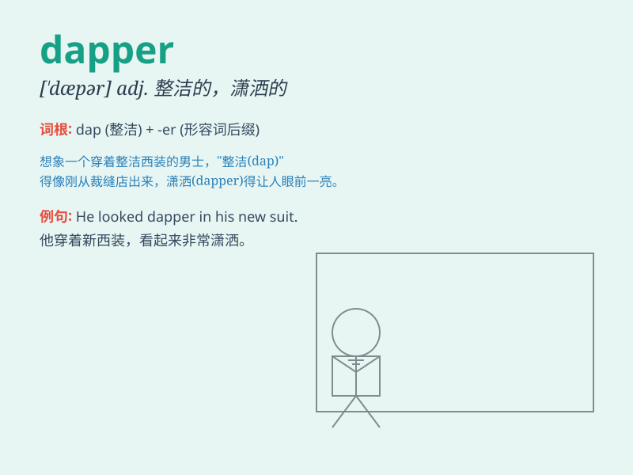

## dapper

**英音:** _[\'dæpə]_ **美音:** _[\'dæpɚ]_

**译义:**
*adj.整洁的,整齐的,短小精悍的,小巧玲珑的,潇洒的,衣冠楚楚的*

### 短语

+ **dapper gentleman:** _衣冠楚楚的绅士_

+ **dapper appearance:** _整洁的外表_

+ **dapper style:** _时髦的风格_

+ **dapper dress:** _整洁的服装_

+ **dapper look:** _利落的样子_

### 例句

#### 例句1

> **The dapper gentleman wore a neatly tailored suit and a polished
pair of shoes.**

**中文翻译:**
这位衣冠楚楚的绅士穿着一套剪裁得体的西装和一双擦亮的鞋子。

**单词释义:** 衣冠楚楚的；整洁漂亮的

#### 例句2

> **He always appears dapper, even after a long day at work.**

**中文翻译:** 即使在工作了一整天之后，他总是显得整洁利落。

**单词释义:** 整洁利落的

#### 例句3

> **The dapper waiter greeted us with a charming smile.**

**中文翻译:** 那位整洁帅气的服务员带着迷人的微笑迎接我们。

**单词释义:** 整洁帅气的

### 背诵小故事

> A dapper gentleman always wears a neatly tailored suit and a shiny
pair of shoes. He combs his hair perfectly and walks with confidence.
His dapper appearance makes him stand out in the crowd.

**一位衣冠楚楚的绅士总是穿着剪裁得体的西装和一双锃亮的鞋子。他把头发梳得整整齐齐，自信地走着。他整洁时髦的外表使他在人群中脱颖而出。**

### 图义

