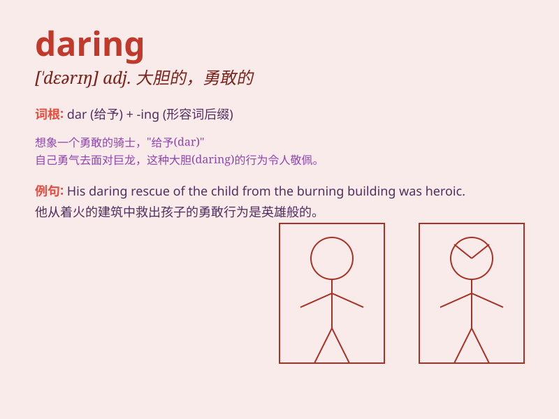

## daring

**英音:** _[\'deərɪŋ]_ **美音:** _[\'dɛrɪŋ]_

**译义:** *adj.大胆的*

### 短语

+ **daring adventure:** _大胆的冒险_

+ **daring deed:** _英勇的行为_

+ **daring escape:** _大胆的逃脱_

+ **daring plan:** _大胆的计划_

+ **daring spirit:** _勇敢的精神_

### 例句

#### 例句1

> **She showed daring in the face of danger.**

**中文翻译:** 她在危险面前表现出了胆量。

**单词释义:** 胆量；勇敢

#### 例句2

> **His daring escape from prison made headlines.**

**中文翻译:** 他大胆地越狱成了头条新闻。

**单词释义:** 大胆的；勇敢的

#### 例句3

> **The daring rescue operation saved many lives.**

**中文翻译:** 这次大胆的救援行动挽救了许多生命。

**单词释义:** 大胆的；勇敢的

### 背诵小故事

> A young adventurer was lost in a forest. Despite the danger, he
showed daring by climbing a tall tree to look for a way out. His
boldness helped him find the path. Remember, daring means being brave
and adventurous.

**一位年轻的冒险家在森林中迷路了。尽管危险重重，他还是表现出了大胆，爬上一棵大树寻找出路。他的勇敢帮助他找到了路径。记住，daring
意思是勇敢和敢于冒险。**

### 图义

