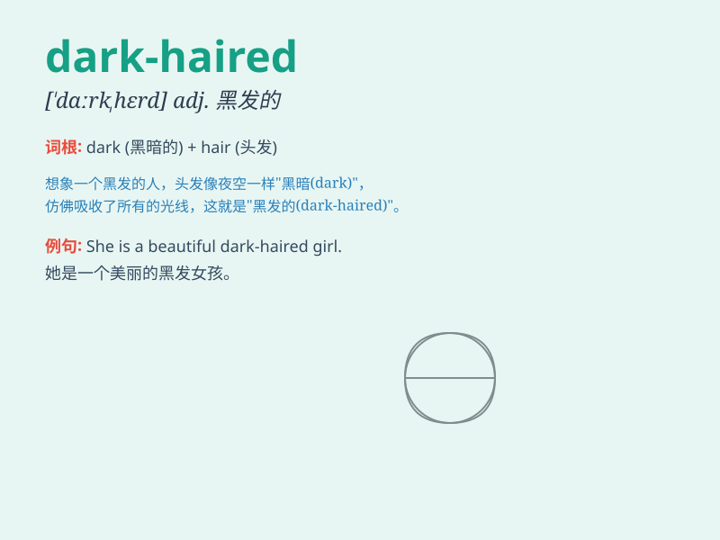

## dark-haired

**英音:** _[dɑːrk ˈheəd]_ **美音:** _[dɑrk ˈherd]_

**译义:** *adj. 黑发的；深色头发的*

### 短语

+ **dark-haired girl:** _黑发女孩_

+ **dark-haired man:** _黑发男子_

+ **dark-haired child:** _黑发孩子_

+ **dark-haired woman:** _黑发女人_

+ **dark-haired beauty:** _黑发美女_

### 例句

#### 例句1

> **The dark-haired girl is my sister.**

**中文翻译:** 那个黑发女孩是我的妹妹。

**单词释义:** 黑发的

#### 例句2

> **He has a crush on the dark-haired woman at the party.**

**中文翻译:** 他在聚会上喜欢上了那个黑发女子。

**单词释义:** 黑发的

#### 例句3

> **The dark-haired man is a famous actor.**

**中文翻译:** 那个黑发男子是一位著名演员。

**单词释义:** 黑发的

### 背诵小故事

> Once upon a time, there was a girl in a dark forest. She had
beautiful dark-haired. A prince saw her and was attracted by her
charming hair. From then on, they had a wonderful story.

**从前，在一个黑暗的森林里有一个女孩。她有着美丽的深色头发。一位王子看到了她，并被她迷人的头发所吸引。从此，他们有了一个精彩的故事。**

### 图义

