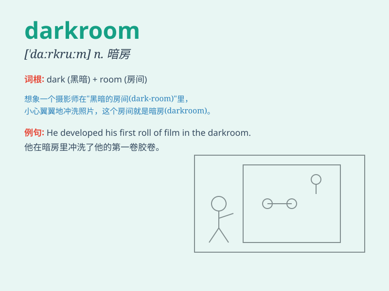

## darkroom

**英音:** _[\'dɑːkruːm; -rʊm]_ **美音:** _[\'dɑrkrum]_

**译义:** *n.(冲洗底片的)暗室,暗房*

### 短语

+ **darkroom equipment:** _暗房设备_

+ **enter the darkroom:** _进入暗房_

+ **darkroom techniques:** _暗房技术_

+ **work in the darkroom:** _在暗房工作_

+ **darkroom chemicals:** _暗房化学药品_

### 例句

#### 例句1

> **The photographer spent hours in the darkroom developing the
film.**

**中文翻译:** 这位摄影师在暗房里花了几个小时冲洗胶卷。

**单词释义:** 暗房

#### 例句2

> **We need to keep the chemicals in the darkroom at a constant
temperature.**

**中文翻译:** 我们需要将暗房里的化学药品保持在恒温状态。

**单词释义:** 暗房

#### 例句3

> **The darkroom was equipped with the latest printing
technology.**

**中文翻译:** 这个暗房配备了最新的冲印技术。

**单词释义:** 暗房

### 背诵小故事

> One day, a curious boy entered a darkroom. It was so dark that he
couldn\'t see anything. But as he turned on the light, he saw all the
photo developing equipment. Now he knew what a darkroom was for.

**一天，一个好奇的男孩走进一间暗室。里面太黑了，他什么都看不见。但当他打开灯，他看到了所有的照片冲洗设备。现在他知道暗室是做什么用的了。**

### 图义

