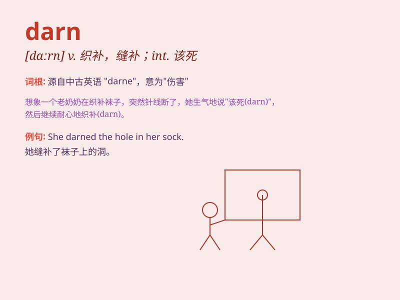

## darn

**英音:** _[dɑːn]_ **美音:** _[dɑrn]_

**译义:** *n.v.织补*

### 短语

+ **darn it:** _（表示愤怒、厌烦、失望等）该死，讨厌_

+ **darn socks:** _织补袜子_

+ **darn clothes:** _缝补衣服_

+ **a darn good job:** _一项非常出色的工作_

+ **I\'ll be darned:** _（表示惊讶）真没想到，真叫我吃惊_

### 例句

#### 例句1

> **I darned the hole in my sock.**

**中文翻译:** 我补好了袜子上的洞。

**单词释义:** 缝补

#### 例句2

> **You did a darn good job!**

**中文翻译:** 你干得非常好！

**单词释义:** 非常；极其

#### 例句3

> **Darn it! I forgot my keys.**

**中文翻译:** 该死！我忘带钥匙了。

**单词释义:** （表示愤怒、厌烦、失望等）该死，讨厌

### 背诵小故事

> One day, I accidentally tore my favorite shirt. I was so frustrated
and shouted, \'Darn!\' which means I was really annoyed. It\'s a word we
use when something goes wrong and we\'re not happy about it.

**有一天，我不小心撕破了我最喜欢的衬衫。我非常沮丧并喊道："该死！"这意味着我真的很恼火。这是当事情出错并且我们对此不高兴时使用的一个词。**

### 图义

