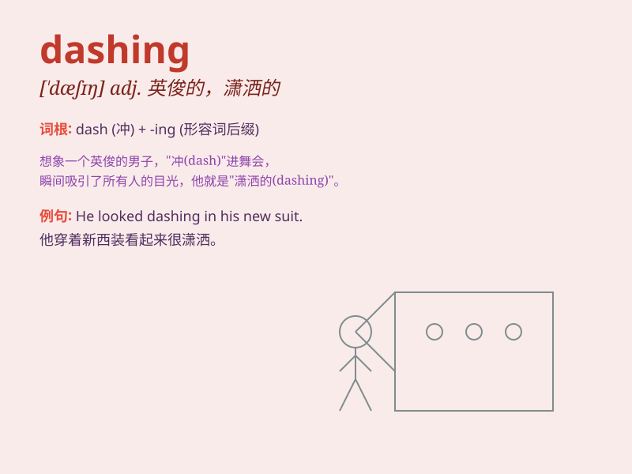

## dashing

**英音:** _[\'dæʃɪŋ]_ **美音:** _[\'dæʃɪŋ]_

**译义:** *adj.活跃的,浮华的*

### 短语

+ **dashing figure:** _潇洒的身影_

+ **dashing style:** _时髦的风格_

+ **dashing smile:** _迷人的微笑_

+ **dashing personality:** _有魅力的个性_

+ **dashing speed:** _飞快的速度_

### 例句

#### 例句1

> **He was a dashing young officer in the army.**

**中文翻译:** 他是军队里一位英俊潇洒的年轻军官。

**单词释义:** 英俊潇洒的

#### 例句2

> **The dashing thief managed to escape before the police
arrived.**

**中文翻译:** 那个冲劲十足的小偷在警察到来之前设法逃跑了。

**单词释义:** 冲劲十足的；有闯劲的

#### 例句3

> **She wore a dashing red dress to the party.**

**中文翻译:** 她穿着一件亮丽的红色连衣裙去参加聚会。

**单词释义:** 亮丽的；时髦的

### 背诵小故事

> A prince was known for his dashing looks and brave deeds. He rode a
white horse and saved the kingdom many times. His dashing style made
everyone admire him.

**一位王子因其英俊潇洒的外表和英勇的行为而闻名。他骑着一匹白马，多次拯救了王国。他那潇洒的风格让每个人都钦佩不已。**

### 图义

