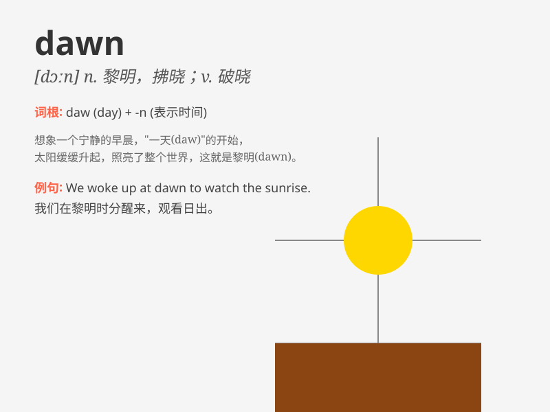

## dawn

**英音:** _[dɔːn]_ **美音:** _[dɔn; dɑn]_

**译义:** *n.黎明,拂晓,破晓vi.破晓,开始现生,变得(为人所)明白v.破晓
Dawn 道恩(女子名)*

### 短语

+ **at dawn:** _在黎明；在破晓_

+ **before dawn:** _黎明前_

+ **dawn on:** _（某事）开始被理解；渐渐明白_

+ **the dawn of sth:** _某事的开端；某事的曙光_

+ **from dawn till dusk:** _从黎明到黄昏；整天_

### 例句

#### 例句1

> **The dawn of a new era has arrived.**

**中文翻译:** 一个新时代的黎明已经到来。

**单词释义:** 黎明；开端

#### 例句2

> **She woke up at dawn to go for a run.**

**中文翻译:** 她黎明时分醒来去跑步。

**单词释义:** 黎明；破晓

#### 例句3

> **The truth dawned on him slowly.**

**中文翻译:** 他慢慢地明白了真相。

**单词释义:** 开始明白；变得明朗

### 背诵小故事

>
在一个宁静的乡村，一位早起的农夫每天都会在天空刚出现第一道曙光（dawn）时就出门劳作。那微弱的光线逐渐变强，照亮了整个田野，也开启了新的一天。

**在一个宁静的乡村，一位早起的农夫每天都会在天空刚出现第一道曙光时就出门劳作。那微弱的光线逐渐变强，照亮了整个田野，也开启了新的一天。**

### 图义

