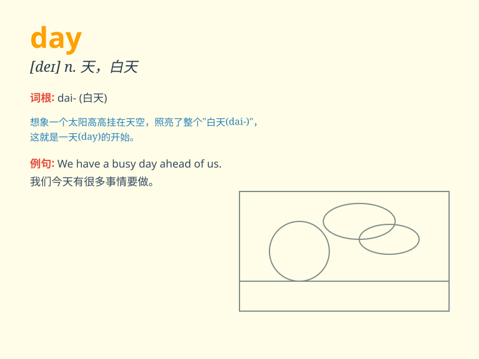

## day

**英音:** _[deɪ]_ **美音:** _[de]_

**译义:** *n.天,白天,日子,白昼,黎明,工作日,节日,重要日子*

### 短语

+ **day by day:** _一天天；逐日_

+ **all day:** _整天；全天_

+ **one day:** _（将来）有一天；总有一天_

+ **day after day:** _日复一日；天天_

+ **these days:** _现在；目前；如今_

### 例句

#### 例句1

> **I have a busy day today.**

**中文翻译:** 我今天有忙碌的一天。

**单词释义:** 一天；白昼；工作日

#### 例句2

> **The day after tomorrow is my birthday.**

**中文翻译:** 后天是我的生日。

**单词释义:** 白天；日子

#### 例句3

> **He works hard every day to support his family.**

**中文翻译:** 他每天努力工作以养家糊口。

**单词释义:** 每一天

### 背诵小故事

> One day, a little bird woke up early and sang happily. The sun shone
brightly, and people went about their activities. It was a wonderful day
filled with joy and opportunities.

**有一天，一只小鸟早早醒来欢快地歌唱。阳光明媚，人们进行着各自的活动。这是充满欢乐和机遇的美好的一天。**

### 图义

