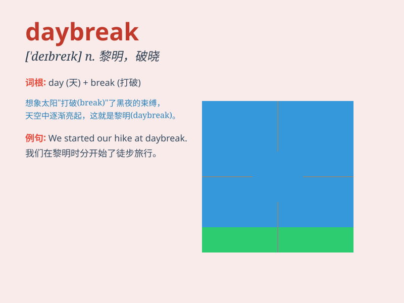

## daybreak

**英音:** _[\'deɪbreɪk]_ **美音:** _[\'debrek]_

**译义:** *n.黎明,拂晓*

### 短语

+ **at daybreak:** _在黎明时分_

+ **before daybreak:** _在黎明之前_

+ **after daybreak:** _在黎明之后_

+ **daybreak hour:** _黎明时刻_

+ **daybreak scene:** _黎明的景色_

### 例句

#### 例句1

> **The birds start singing at daybreak.**

**中文翻译:** 鸟儿在黎明时开始歌唱。

**单词释义:** 黎明；破晓

#### 例句2

> **We set off at daybreak to catch the early train.**

**中文翻译:** 我们在黎明时出发去赶早班火车。

**单词释义:** 黎明；破晓

#### 例句3

> **Daybreak found us still on the road.**

**中文翻译:** 黎明时我们仍在路上。

**单词释义:** 黎明；破晓

### 背诵小故事

> One day, a little bird woke up very early. When it opened its eyes,
it saw the sky changing colors. It knew it was daybreak, the beautiful
moment when the night ended and the new day began.

**有一天，一只小鸟醒得很早。当它睁开眼睛时，看到天空正在变色。它知道这是黎明，即夜晚结束、新的一天开始的美好时刻。**

### 图义

