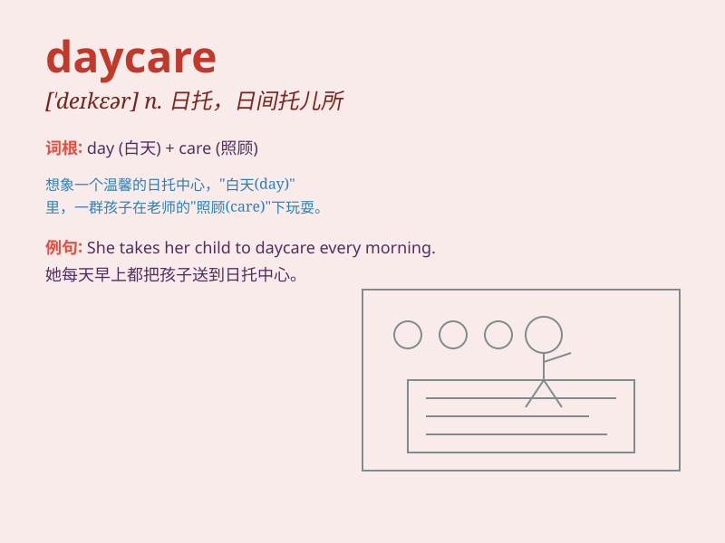

## daycare

**英音:** _[ˈdeɪkeə]_ **美音:** _[ˈdeɪker]_

**译义:** *n. 日托，日间托儿所*

### 短语

+ **daycare center:** _日托中心_

+ **daycare provider:** _日托提供者_

+ **daycare facility:** _日托设施_

+ **daycare worker:** _日托工作者_

+ **daycare service:** _日托服务_

### 例句

#### 例句1

> **She takes her child to daycare every morning.**

**中文翻译:** 她每天早上送孩子去日托所。

**单词释义:** 日托所；托儿所

#### 例句2

> **The daycare center provides a safe and fun environment for
children.**

**中文翻译:** 这家日托中心为孩子们提供了一个安全又有趣的环境。

**单词释义:** 日托所；托儿所

#### 例句3

> **We are looking for a good daycare for our toddler.**

**中文翻译:** 我们正在为我们学步的孩子找一家好的日托所。

**单词释义:** 日托所；托儿所

### 背诵小故事

> One day, a little bear was sent to daycare. There, he played with
toys, had snacks, and made new friends. It was a fun place for kids to
stay during the day while their parents were busy.

**有一天，一只小熊被送去了日托所。在那里，他玩玩具、吃零食，还交了新朋友。这是一个在白天父母忙碌时孩子们待着的有趣地方。**

### 图义

