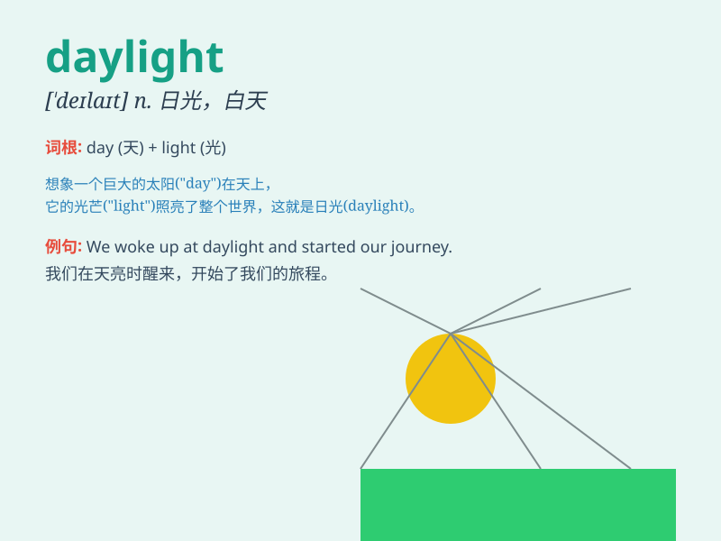

## daylight

**英音:** _[\'deɪlaɪt]_ **美音:** _[\'delaɪt]_

**译义:** *n.日光,白昼,白天*

### 短语

+ **in daylight:** _在白天_

+ **daylight saving time:** _夏令时_

+ **daylight robbery:** _光天化日之下的抢劫_

+ **see daylight:** _有希望；看到曙光_

+ **broad daylight:** _大白天；光天化日_

### 例句

#### 例句1

> **I like to go for a walk in the daylight.**

**中文翻译:** 我喜欢在白天散步。

**单词释义:** 白天；日光

#### 例句2

> **The thief was caught in the daylight.**

**中文翻译:** 那个小偷在光天化日之下被抓住了。

**单词释义:** 白昼；日光

#### 例句3

> **Daylight saving time begins in the spring.**

**中文翻译:** 夏令时在春天开始。

**单词释义:** 日光；白昼时间

### 背诵小故事

> One day, a little mouse was very scared in the darkness. But when the
daylight came, it felt safe and started to play happily. The daylight
brought warmth and hope.

**有一天，一只小老鼠在黑暗中非常害怕。但当日光出现时，它感到安全并开始愉快地玩耍。日光带来了温暖和希望。**

### 图义

