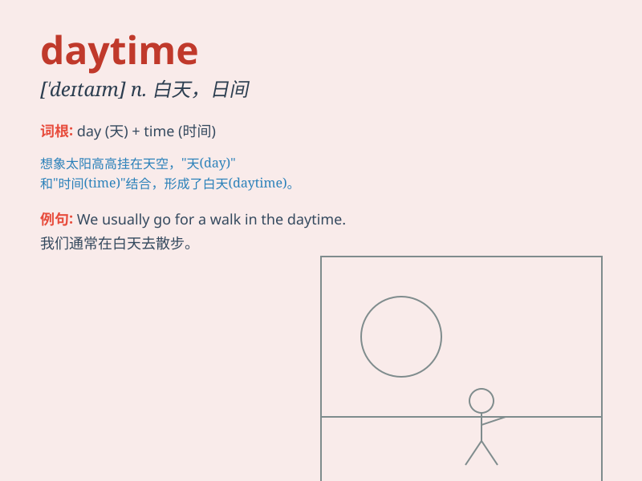

## daytime

**英音:** _[\'deɪtaɪm]_ **美音:** _[\'detaɪm]_

**译义:** *n.白天,日间*

### 短语

+ **daytime hours:** _白天的时间_

+ **daytime activities:** _白天的活动_

+ **daytime job:** _白天的工作_

+ **during daytime:** _在白天期间_

+ **daytime temperature:** _白天的温度_

### 例句

#### 例句1

> **Daytime temperatures can reach up to 30 degrees Celsius in
summer.**

**中文翻译:** 在夏天，白天的温度能够达到 30 摄氏度。

**单词释义:** 白天

#### 例句2

> **Most people are at work during the daytime.**

**中文翻译:** 大多数人在白天工作。

**单词释义:** 白天

#### 例句3

> **Daytime is the best time to explore the city.**

**中文翻译:** 白天是探索这座城市的最佳时间。

**单词释义:** 白天

### 背诵小故事

> One day, a little mouse was very scared to go out at night. But when
it was daytime, with the sun shining bright, it felt brave and started
to play happily. Daytime means the time when it\'s light and safe.

**有一天，一只小老鼠晚上很害怕出去。但是到了白天，阳光灿烂，它就感到勇敢，开始开心地玩耍。daytime
意思是有光亮且安全的那段时间。**

### 图义

