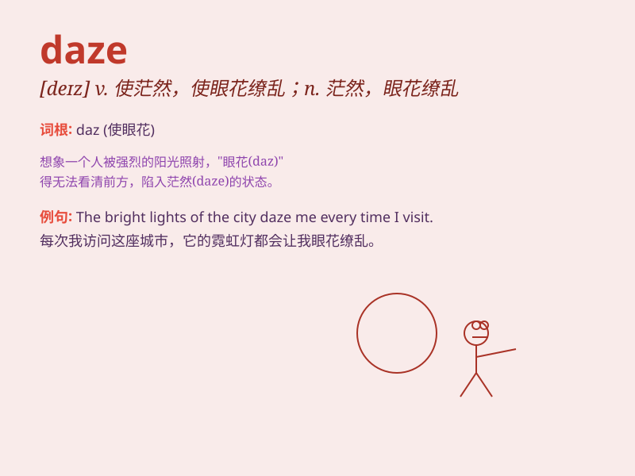

## daze

**英音:** _[deɪz]_ **美音:** _[dez]_

**译义:** *vt.使茫然,发昏,使晕眩n.迷惑,眼花缭乱*

### 短语

+ **in a daze:** _茫然；恍惚；处于恍惚状态_

+ **stun into a daze:** _震惊得发呆_

+ **come out of a daze:** _从恍惚中清醒过来_

+ **throw someone into a daze:** _使某人发愣；使某人茫然_

+ **be dazed with:** _因\...\...而茫然_

### 例句

#### 例句1

> **The accident left him in a daze for several minutes.**

**中文翻译:** 这场事故让他恍惚了好几分钟。

**单词释义:** 恍惚；茫然

#### 例句2

> **She was in a daze after receiving the unexpected news.**

**中文翻译:** 收到这个意外的消息后，她处于茫然状态。

**单词释义:** 茫然；迷乱

#### 例句3

> **The bright light dazed her eyes for a moment.**

**中文翻译:** 强光使她的眼睛一下子花了。

**单词释义:** 使眼花；使眩晕

### 背诵小故事

> A young man was lost in the forest for days. When he was finally
found, he was in a daze. He couldn\'t remember how he got there or what
happened. The experience left him confused and disoriented.

**一个年轻人在森林里迷路了好几天。当他最终被找到时，他处于茫然状态。他不记得自己是怎么到那里的，也不记得发生了什么。这次经历让他感到困惑和迷失方向。**

### 图义

