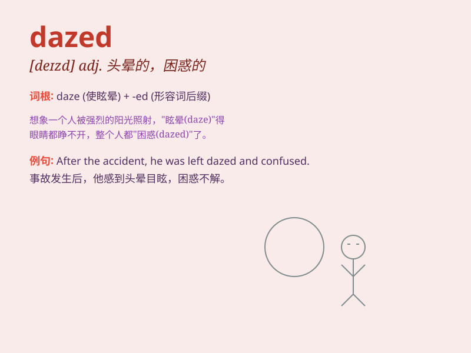

## dazed

**英音:** _[deɪzd]_ **美音:** _[deɪzd]_

**译义:** *adj.头昏的,眼花的*

### 短语

+ **be dazed with:** _因\...\...而茫然_

+ **dazed look:** _茫然的表情_

+ **feel dazed:** _感到茫然_

+ **dazed state:** _茫然的状态_

+ **dazed mind:** _茫然的头脑_

### 例句

#### 例句1

> **He looked dazed after the accident.**

**中文翻译:** 事故发生后，他看起来神情恍惚。

**单词释义:** 神情恍惚的

#### 例句2

> **The heat made her feel dazed.**

**中文翻译:** 炎热使她感觉头昏眼花。

**单词释义:** 头昏眼花的

#### 例句3

> **She was dazed by the sudden news.**

**中文翻译:** 她被这突然的消息弄得茫然不知所措。

**单词释义:** 茫然的

### 背诵小故事

> A man was in a car accident and got hit on the head. When he woke up,
he was dazed and couldn\'t remember what happened. He felt confused and
disoriented, as if in a fog.

**一个男人遭遇了车祸，头部被撞。当他醒来时，他感到头晕目眩，记不起发生了什么。他感觉困惑和迷失方向，仿佛置身于迷雾之中。**

### 图义

