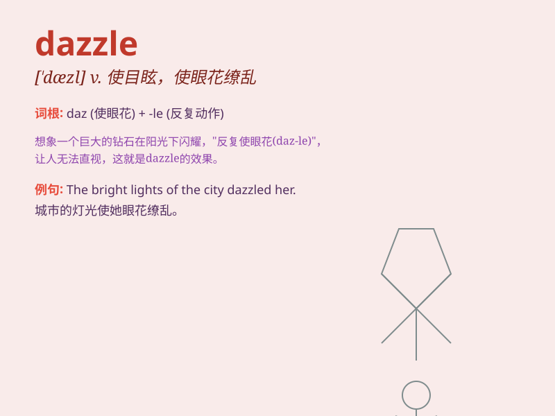

## dazzle

**英音:** _[\'dæz(ə)l]_ **美音:** _[\'dæzl]_

**译义:** *v.(使)眼花,眩耀n.耀眼*

### 短语

+ **dazzle sb with sth:** _用某物使某人目眩；用某物使某人惊叹_

+ **be dazzled by:** _被\...\...弄得眼花缭乱；被\...\...弄得目眩_

+ **dazzle the audience:** _使观众目眩；令观众惊叹_

+ **dazzle the eyes:** _耀眼；眩目_

+ **visual dazzle:** _视觉上的耀眼；视觉上的眩目_

### 例句

#### 例句1

> **The fireworks display was enough to dazzle the crowd.**

**中文翻译:** 烟花表演足以让人群眼花缭乱。

**单词释义:** 使眼花；使目眩

#### 例句2

> **She was dazzled by his charm and good looks.**

**中文翻译:** 她被他的魅力和英俊外表迷得神魂颠倒。

**单词释义:** 使倾倒；使赞叹不已

#### 例句3

> **The sunlight dazzled me as I walked out of the building.**

**中文翻译:** 我走出大楼时，阳光照得我睁不开眼。

**单词释义:** 使目眩；使眼花

### 背诵小故事

> A brave knight was exploring a dark cave. When he emerged, the bright
sunlight outside dazzled him. He had to cover his eyes. But soon, he
adjusted and saw the beautiful world.

**一位勇敢的骑士在探索一个黑暗的洞穴。当他出来时，外面明亮的阳光使他目眩。他不得不遮住眼睛。但很快，他适应了并看到了美丽的世界。**

### 图义

