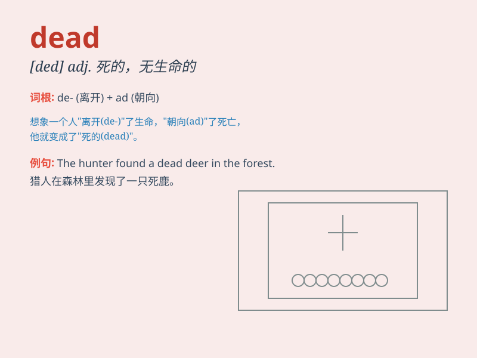

## dead

**英音:** _[ded]_ **美音:** _[dɛd]_

**译义:**
*adj.死的,无感觉的,呆板的,不流动的,(语言、习惯)废弃了的,熄灭的n.死者adv.完全地,绝对的,突然的*

### 短语

+ **dead end:** _死胡同；绝境_

+ **dead weight:** _重负；沉重的负担_

+ **dead line:** _截止日期_

+ **dead heat:** _不分胜负；同时到达终点_

+ **dead on:** _完全正确；十分精确_

### 例句

#### 例句1

> **The battery is dead.**

**中文翻译:** 电池没电了。

**单词释义:** 没电的；耗尽的

#### 例句2

> **He has been dead for three years.**

**中文翻译:** 他已经去世三年了。

**单词释义:** 死亡的；去世的

#### 例句3

> **The phone line went dead.**

**中文翻译:** 电话线路中断了。

**单词释义:** 中断的；失去作用的

### 背诵小故事

> One night, I was walking in a dark forest. Suddenly, I saw a figure
lying still on the ground. When I got closer, I found it was a dead
person. It was a scary experience.

**一天晚上，我在一片黑暗的森林里走着。突然，我看到地上有一个一动不动的身影。当我走近时，发现那是一个死人。这是一次可怕的经历。**

### 图义

