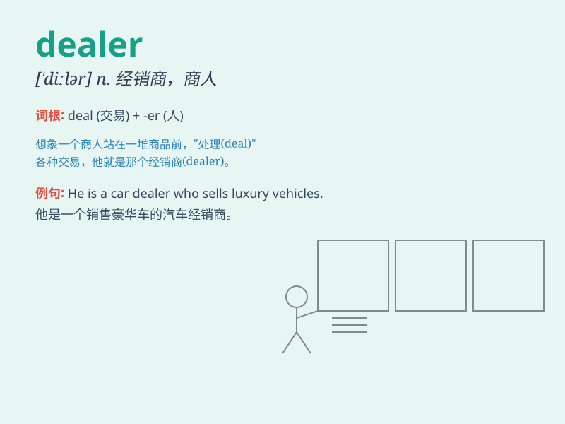

## dealer

**英音:** _[\'diːlə]_ **美音:** _[\'dilɚ]_

**译义:** *n.经销商,商人*

### 短语

+ **card dealer:** _纸牌发牌员_

+ **car dealer:** _汽车经销商_

+ **drug dealer:** _毒品贩子_

+ **authorized dealer:** _授权经销商_

+ **local dealer:** _当地经销商_

### 例句

#### 例句1

> **The car dealer showed us several models.**

**中文翻译:** 汽车经销商给我们展示了几款车型。

**单词释义:** 经销商

#### 例句2

> **He\'s a dealer in antiques.**

**中文翻译:** 他是个古董商。

**单词释义:** 商人

#### 例句3

> **The drug dealer was arrested by the police.**

**中文翻译:** 那个毒贩被警察逮捕了。

**单词释义:** 贩子

### 背诵小故事

> A dealer was selling rare jewels in a secret room. One day, a
detective found him. The dealer tried to hide but was caught. Now you
know \'dealer\' means someone who buys and sells things.

**一个经销商在一个秘密房间里出售稀有的珠宝。有一天，一名侦探发现了他。这个经销商试图躲藏但被抓住了。现在你知道\'dealer\'意思是买卖东西的人。**

### 图义

