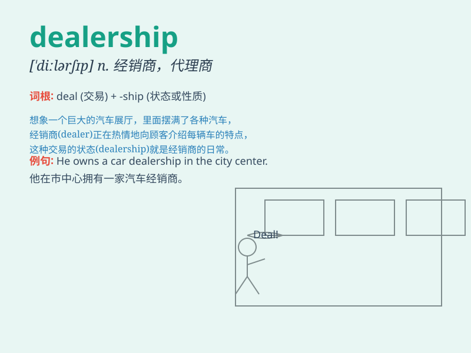

## dealership

**英音:** _[\'diːləʃɪp]_ **美音:** _[\'dilɚʃɪp]_

**译义:** *n.代理权,经销权*

### 短语

+ **car dealership:** _汽车经销商_

+ **franchise dealership:** _特许经销商_

+ **dealership network:** _经销商网络_

+ **local dealership:** _当地经销商_

+ **dealership agreement:** _经销商协议_

### 例句

#### 例句1

> **The car dealership offers a wide range of vehicles.**

**中文翻译:** 这家汽车经销商提供各种各样的车辆。

**单词释义:** 经销商

#### 例句2

> **He got a great deal at the local dealership.**

**中文翻译:** 他在当地的经销商那里得到了一笔很好的交易。

**单词释义:** 经销商

#### 例句3

> **The dealership has an excellent reputation for customer
service.**

**中文翻译:** 这家经销商在客户服务方面享有极好的声誉。

**单词释义:** 经销商

### 背诵小故事

> A young man dreamed of having his own dealership. He worked hard,
learned about cars, and finally opened a successful dealership. People
came from far and wide to buy cars from him.

**一个年轻人梦想拥有自己的汽车经销商店铺。他努力工作，学习汽车知识，最终成功开了一家经销商店。人们从四面八方赶来向他买车。**

### 图义

