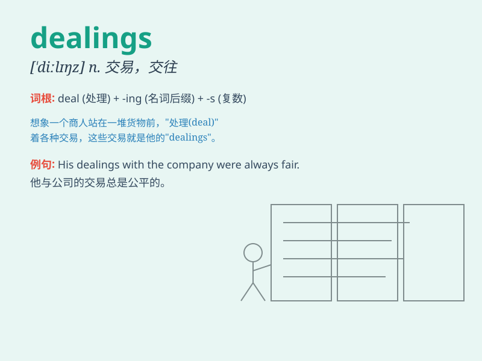

## dealings

**英音:** _[ˈdiːlɪŋz]_ **美音:** _[ˈdiːlɪŋz]_

**译义:** *n.交易; 买卖;（与某人的）关系; 交往（deal的复数形式）*

### 短语

+ **business dealings:** _商业往来；业务交易_

+ **financial dealings:** _财务交易；金融往来_

+ **secret dealings:** _秘密交易；秘密往来_

+ **fair dealings:** _公平交易；公正往来_

+ **shady dealings:** _不正当交易；可疑的往来_

### 例句

#### 例句1

> **His dealings with clients are always professional.**

**中文翻译:** 他与客户的往来总是很专业。

**单词释义:** 往来，交易

#### 例句2

> **The company\'s financial dealings are under investigation.**

**中文翻译:** 这家公司的财务往来正在接受调查。

**单词释义:** 交易，业务关系

#### 例句3

> **I have no dealings with that person anymore.**

**中文翻译:** 我不再和那个人有往来了。

**单词释义:** 交往，往来

### 背诵小故事

> A merchant had many dealings with different customers. Some were
friendly, but some were tricky. Through these dealings, the merchant
learned to be smart and cautious.

**一位商人与不同的客户有很多往来。有些客户很友好，但有些很狡猾。通过这些往来，商人学会了聪明和谨慎。**

### 图义

