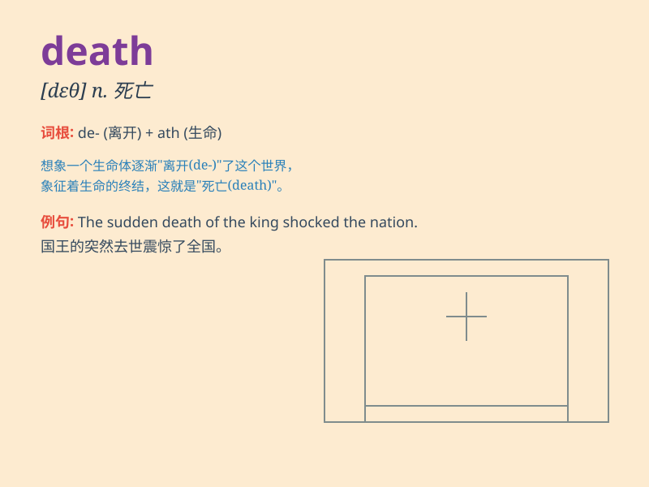

## death

**英音:** _[deθ]_ **美音:** _[dɛθ]_

**译义:** *n.死,死亡,致死的原因,毁灭,屠杀*

### 短语

+ **put to death:** _处死；杀死_

+ **to the death:** _至死；到底_

+ **fear of death:** _对死亡的恐惧_

+ **death penalty:** _死刑_

+ **sudden death:** _猝死；突然死亡_

### 例句

#### 例句1

> **The death of his father was a great shock to him.**

**中文翻译:** 他父亲的去世对他是一个巨大的打击。

**单词释义:** 死亡

#### 例句2

> **The doctor fought against death to save the patient.**

**中文翻译:** 医生为挽救病人的生命与死亡作斗争。

**单词释义:** 死亡

#### 例句3

> **The criminal was sentenced to death.**

**中文翻译:** 这个罪犯被判处死刑。

**单词释义:** 死亡；死刑

### 背诵小故事

> A brave knight was fighting in a fierce battle. Despite his efforts,
he was severely wounded. In the end, he closed his eyes and met his
death. But his spirit lived on.

**一位勇敢的骑士在一场激烈的战斗中战斗。尽管他努力了，但他受了重伤。最后，他闭上了眼睛，迎来了死亡。但他的精神永存。**

### 图义

