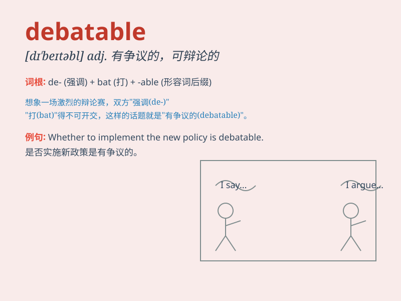

## debatable

**英音:** _[dɪ\'beɪtəb(ə)l]_ **美音:** _[dɪ\'betəbəl]_

**译义:** *adj.可争议的*

### 短语

+ **debatable issue:** _有争议的问题_

+ **debatable point:** _可争论的要点_

+ **debatable matter:** _有争议的事情_

+ **debatable topic:** _可辩论的话题_

+ **debatable claim:** _有争议的主张_

### 例句

#### 例句1

> **Whether the new policy will be effective is debatable.**

**中文翻译:** 新政策是否会有效是有争议的。

**单词释义:** 有争议的；可争辩的

#### 例句2

> **The morality of cloning humans is a highly debatable issue.**

**中文翻译:** 克隆人的道德性是一个极具争议的问题。

**单词释义:** 有争议的；可争辩的

#### 例句3

> **It\'s debatable whether he is the right person for the job.**

**中文翻译:** 他是否是这份工作的合适人选是有争议的。

**单词释义:** 有争议的；可争辩的

### 背诵小故事

> A group of friends were discussing where to go for vacation. Some
suggested the beach, others the mountains. The final decision was
debatable. It means the matter was open to argument and not clearly
decided.

**一群朋友在讨论去哪里度假。一些人建议去海滩，另一些人建议去山区。最终的决定是有争议的。这意味着这件事有待争论，没有明确决定。**

### 图义

