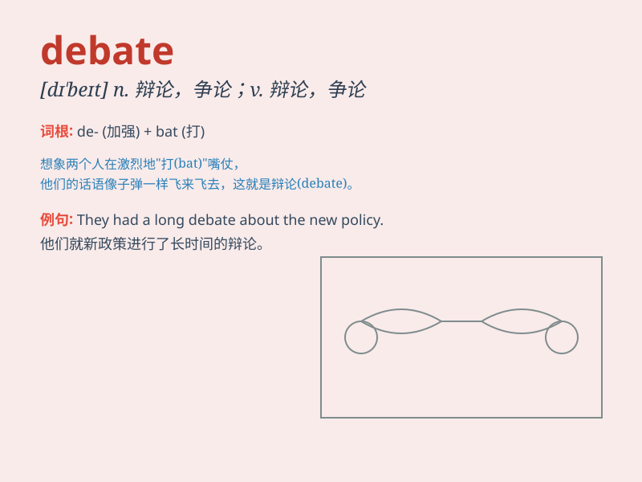

## debate

**英音:** _[dɪ\'beɪt]_ **美音:** _[dɪ\'bet]_

**译义:** *v.争论,辩论n.争论,辩论*

### 短语

+ **debate on:** _关于\...\...进行辩论_

+ **under debate:** _在讨论中；在辩论中_

+ **open debate:** _公开辩论_

+ **heated debate:** _激烈的辩论_

+ **debate with:** _与\...\...辩论_

### 例句

#### 例句1

> **The politicians engaged in a heated debate on the new policy.**

**中文翻译:** 政客们就新政策展开了激烈的辩论。

**单词释义:** 辩论；争论

#### 例句2

> **There is a debate among scientists about the origin of the
universe.**

**中文翻译:** 科学家们对宇宙的起源存在争论。

**单词释义:** 争论；讨论

#### 例句3

> **The school is holding a debate competition next week.**

**中文翻译:** 学校下周将举办一场辩论比赛。

**单词释义:** 辩论会；辩论赛

### 背诵小故事

> In a big meeting, two teams had a debate. One team said we should go
left, the other said right. They gave reasons and argued loudly.
Finally, they found the best way. Remember, debate is a serious
discussion.

**在一个大型会议中，两个团队进行了一场辩论。一个团队说我们应该向左走，另一个说向右。他们给出理由并大声争论。最后，他们找到了最佳方法。记住，debate
就是认真的讨论。**

### 图义

