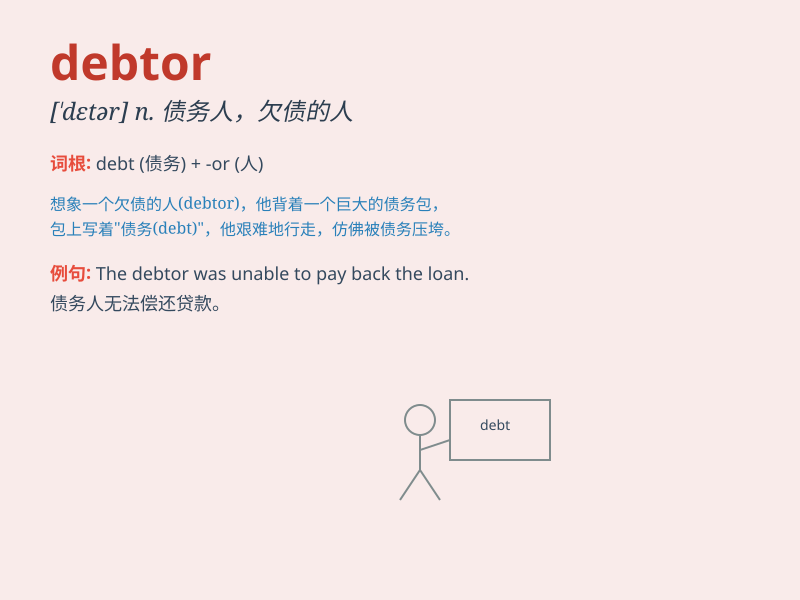

## debtor

**英音:** _[\'detə]_ **美音:** _[\'dɛtɚ]_

**译义:** *n.债务人*

### 短语

+ **insolvent debtor:** _破产的债务人_

+ **corporate debtor:** _公司债务人_

+ **major debtor:** _主要债务人_

+ **defaulting debtor:** _违约债务人_

+ **chronic debtor:** _长期债务人_

### 例句

#### 例句1

> **The debtor was unable to repay the loan on time.**

**中文翻译:** 这位债务人无法按时偿还贷款。

**单词释义:** 债务人

#### 例句2

> **The company is chasing the debtor for the outstanding
payment.**

**中文翻译:** 公司正在追讨这位债务人未付的款项。

**单词释义:** 债务人

#### 例句3

> **The debtor sought legal advice to deal with the debt.**

**中文翻译:** 这位债务人寻求法律建议来处理债务。

**单词释义:** 债务人

### 背诵小故事

> A debtor was in a big trouble. He borrowed a lot of money but
couldn\'t pay it back. People were chasing after him for the debt.
Finally, he realized his mistake and started to work hard to clear his
debts.

**一个债务人陷入了大麻烦。他借了很多钱却还不起。人们追着他讨债。最后，他意识到自己的错误，开始努力工作来还清债务。**

### 图义

