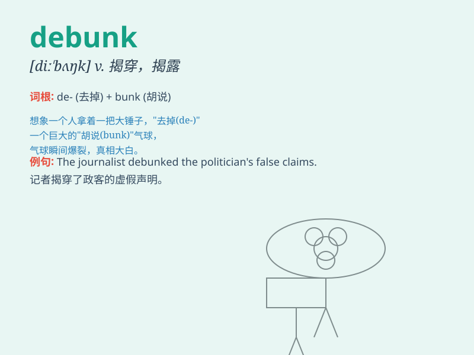

## debunk

**英音:** _[diː\'bʌŋk]_ **美音:** _[\'di\'bʌŋk]_

**译义:** *vt.揭穿,拆穿假面具,暴露*

### 短语

+ **debunk a myth:** _揭穿一个神话_

+ **debunk a claim:** _驳斥一项主张_

+ **debunk a theory:** _推翻一个理论_

+ **debunk a rumor:** _戳穿一个谣言_

+ **debunk a superstition:** _破除一种迷信_

### 例句

#### 例句1

> **The scientist debunked the myth of perpetual motion.**

**中文翻译:** 这位科学家揭穿了永动机的神话。

**单词释义:** 揭穿；揭露；拆穿

#### 例句2

> **It\'s time to debunk the idea that success comes easily.**

**中文翻译:** 是时候戳穿成功来得容易这种想法了。

**单词释义:** 驳斥；否定

#### 例句3

> **The documentary aimed to debunk common misunderstandings about
climate change.**

**中文翻译:** 这部纪录片旨在揭穿关于气候变化的常见误解。

**单词释义:** 戳穿；揭露

### 背诵小故事

> A scientist named Tom was known for debunking myths. One day, people
believed a magic stone could cure all diseases. Tom proved it was
nonsense through experiments and data, showing the truth and debunking
the false claim.

**一位名叫汤姆的科学家以揭穿谬论而闻名。有一天，人们相信一块魔法石可以治愈所有疾病。汤姆通过实验和数据证明这是无稽之谈，展现了真相并揭穿了这个虚假的说法。**

### 图义

