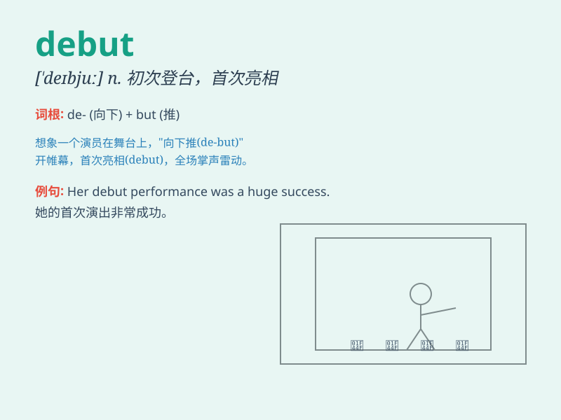

## debut

**英音:** _[\'deɪbjuː; -buː]_ **美音:** _[de\'bju]_

**译义:** *n.v.初次登场,开张*

### 短语

+ **debut album:** _首张专辑_

+ **debut single:** _首张单曲_

+ **make one\'s debut:** _初次亮相；首次登场_

+ **debut performance:** _首次演出；初次表演_

+ **debutante ball:** _初次进入社交界的女子舞会_

### 例句

#### 例句1

> **The young actress made her debut in a Broadway play.**

**中文翻译:** 这位年轻的女演员在一部百老汇戏剧中首次登台。

**单词释义:** 首次登台；初次亮相

#### 例句2

> **The band\'s debut album was a huge success.**

**中文翻译:** 这个乐队的首张专辑取得了巨大的成功。

**单词释义:** 首张（专辑等）

#### 例句3

> **He made his debut as a writer with this novel.**

**中文翻译:** 他以这部小说作为作家初次登场。

**单词释义:** 初次登场（作为作家等）

### 背诵小故事

> A young actress was very nervous on her debut. It was her first
appearance on the big stage. But she did well and everyone loved her.
\'Debut\' means the first public appearance.

**一位年轻的女演员在她的首次亮相时非常紧张。这是她第一次登上大舞台。但她表现出色，大家都喜欢她。'debut'意思是首次亮相。**

### 图义

