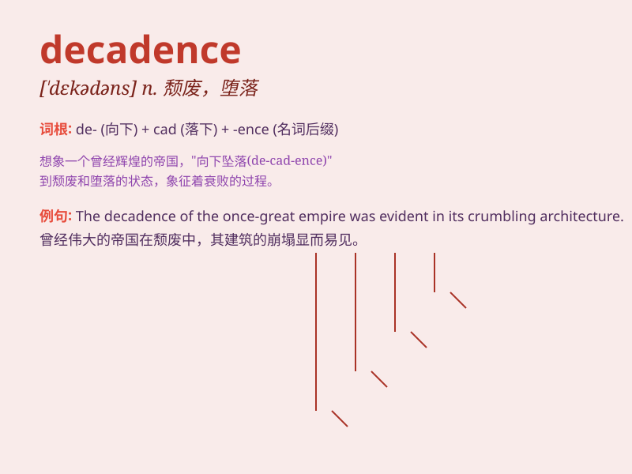

## decadence

**英音:** _[\'dekəd(ə)ns]_ **美音:** _[\'dɛkədəns]_

**译义:** *n.颓废*

### 短语

+ **moral decadence:** _道德败坏_

+ **cultural decadence:** _文化衰落_

+ **period of decadence:** _衰落时期_

+ **fall into decadence:** _陷入衰落_

+ **decadence and decline:** _衰落与衰退_

### 例句

#### 例句1

> **The city\'s nightlife was a symbol of its moral decadence.**

**中文翻译:** 这座城市的夜生活是其道德堕落的一个象征。

**单词释义:** 堕落；衰落

#### 例句2

> **The novel portrays a society in decadence.**

**中文翻译:** 这部小说描绘了一个衰落的社会。

**单词释义:** 衰落；衰败

#### 例句3

> **His lifestyle was a sign of personal decadence.**

**中文翻译:** 他的生活方式是个人堕落的一种标志。

**单词释义:** 堕落；颓废

### 背诵小故事

> A king lived in luxury and ignored his people\'s needs. His kingdom
fell into decadence. No one worked hard, and everything became ruined.
This shows what decadence can do to a once great place.

**一位国王生活奢华，无视人民的需求。他的王国陷入了衰落。无人努力工作，一切都变得破败不堪。这展现了衰落会给曾经伟大的地方带来什么。**

### 图义

