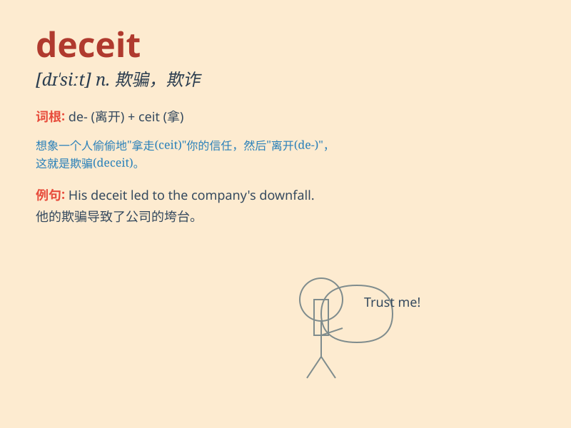

## deceit

**英音:** _[dɪ\'siːt]_ **美音:** _[dɪ\'sit]_

**译义:** *n.欺骗,谎言*

### 短语

+ **act of deceit:** _欺骗行为_

+ **intentional deceit:** _故意的欺骗_

+ **uncover deceit:** _揭露欺骗_

+ **fall victim to deceit:** _成为欺骗的受害者_

+ **perpetrate deceit:** _进行欺骗_

### 例句

#### 例句1

> **His deceit was finally exposed.**

**中文翻译:** 他的欺骗行为最终被曝光了。

**单词释义:** 欺骗；欺诈；谎言

#### 例句2

> **She was accused of deceit in obtaining the contract.**

**中文翻译:** 她被指控在获取合同的过程中有欺诈行为。

**单词释义:** 欺诈；欺骗

#### 例句3

> **The politician\'s career was ruined by deceit.**

**中文翻译:** 这位政治家的职业生涯因欺骗而毁了。

**单词释义:** 欺骗；欺诈

### 背诵小故事

> A fox was known for its deceit. It would pretend to be friendly to
get food from other animals. One day, a wise owl saw through the fox\'s
deceit and warned all the animals. From then on, they avoided the fox.

**一只狐狸以其欺骗行为而闻名。它会假装友好从其他动物那里获取食物。有一天，一只聪明的猫头鹰识破了狐狸的欺骗，警告了所有动物。从那以后，它们都避开了狐狸。**

### 图义

