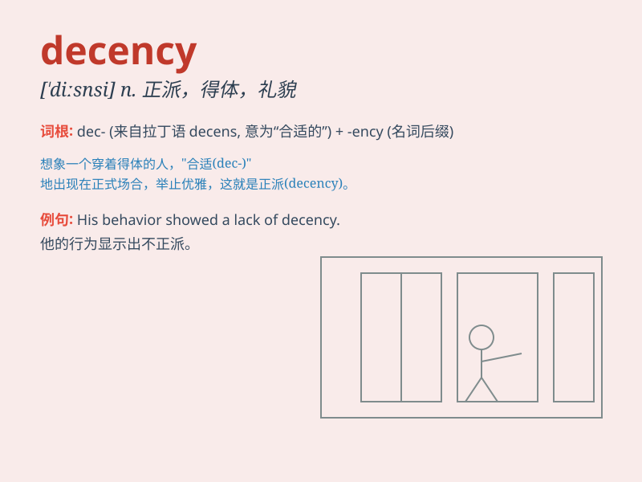

## decency

**英音:** _[\'diːs(ə)nsɪ]_ **美音:** _[\'disnsi]_

**译义:** *n.庄重*

### 短语

+ **common decency:** _起码的礼貌；基本的礼仪_

+ **decency and morality:** _体面和道德_

+ **out of decency:** _出于体面；出于礼仪_

+ **a sense of decency:** _廉耻之心；羞耻感_

+ **observe decency:** _遵守礼仪；注重体面_

### 例句

#### 例句1

> **He always behaves with decency and politeness.**

**中文翻译:** 他总是表现得很得体、有礼貌。

**单词释义:** 得体；正派

#### 例句2

> **The lack of decency in some reality shows is disturbing.**

**中文翻译:** 一些真人秀节目中缺乏正派的行为令人不安。

**单词释义:** 得体；适当

#### 例句3

> **She showed decency by not spreading rumors about her
colleagues.**

**中文翻译:** 她没有散布有关同事的谣言，表现出正派。

**单词释义:** 正派；正直

### 背诵小故事

> A thief broke into a house but was shocked to find a letter about
decency. It made him realize his wrongdoings and return what he stole.
Decency means behaving in a moral and proper way.

**一个小偷闯入一所房子，但震惊地发现了一封关于体面的信。这使他意识到自己的错误行为，并归还了偷的东西。decency
意思是行为举止合乎道德和得体。**

### 图义

