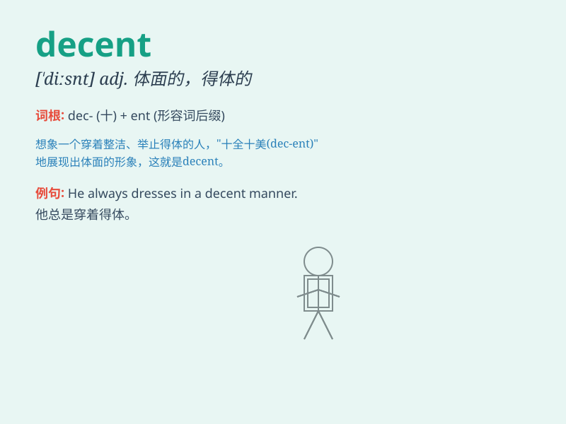

## decent

**英音:** _[\'diːs(ə)nt]_ **美音:** _[\'disnt]_

**译义:**
*adj.正派的,端庄的,有分寸的,(服装)得体的,大方的adj.\<口>相当好的、象样的*

### 短语

+ **decent income:** _体面的收入_

+ **decent job:** _像样的工作_

+ **decent meal:** _丰盛的一餐_

+ **decent behavior:** _得体的行为_

+ **decent clothes:** _得体的衣服_

### 例句

#### 例句1

> **He is a decent person and always helps others.**

**中文翻译:** 他是一个正派的人，总是帮助别人。

**单词释义:** 正派的；得体的

#### 例句2

> **The salary they offered was decent.**

**中文翻译:** 他们提供的薪水很不错。

**单词释义:** 相当好的；像样的

#### 例句3

> **She wore a decent dress to the party.**

**中文翻译:** 她穿着一件得体的衣服去参加聚会。

**单词释义:** 得体的；合乎礼仪的

### 背诵小故事

> A man was lost in a storm. When he found a decent shelter, he felt so
relieved. The shelter was not luxurious but good enough to protect him
from the bad weather. It was a decent place for him to stay safe.

**一个男人在暴风雨中迷路了。当他找到一个像样的避难所时，他感到如释重负。这个避难所不豪华，但足以保护他免受恶劣天气的影响。对他来说，这是一个能保证安全的不错的地方。**

### 图义

