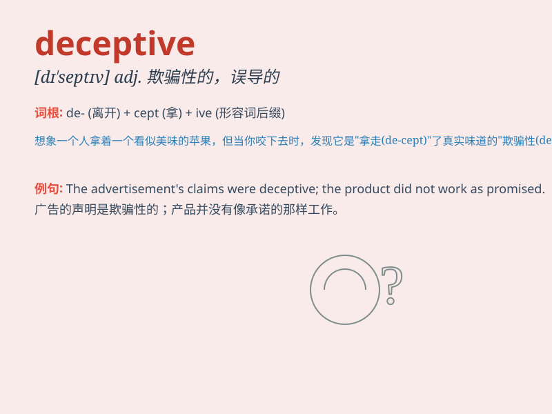

## deceptive

**英音:** _[dɪ\'septɪv]_ **美音:** _[dɪ\'sɛptɪv]_

**译义:** *adj.欺骗性的*

### 短语

+ **deceptive appearance:** _欺骗性的外表_

+ **deceptive practice:** _欺骗性的做法_

+ **deceptive advertisement:** _欺骗性的广告_

+ **deceptive behavior:** _欺骗性行为_

+ **deceptive statement:** _欺骗性的陈述_

### 例句

#### 例句1

> **The advertisement was deceptive and misled many consumers.**

**中文翻译:** 该广告具有欺骗性，误导了很多消费者。

**单词释义:** 欺骗性的

#### 例句2

> **His appearance can be deceptive; he\'s actually very strong.**

**中文翻译:** 他的外表可能具有欺骗性；他其实很强。

**单词释义:** 具有欺骗性的

#### 例句3

> **The calm waters were deceptive; there was a strong
undercurrent.**

**中文翻译:** 平静的水面具有欺骗性。一股强烈的暗流涌动。

**单词释义:** 具有欺骗性的

### 背诵小故事

> A fox tried to deceive a little rabbit by pretending to be friendly.
But the rabbit saw through the fox\'s deceptive smile and ran away. The
fox\'s behavior was not honest and was meant to trick the rabbit.

**一只狐狸试图通过假装友好来欺骗小兔子。但兔子看穿了狐狸欺骗性的笑容然后跑开了。狐狸的行为不诚实，是为了骗兔子。**

### 图义

