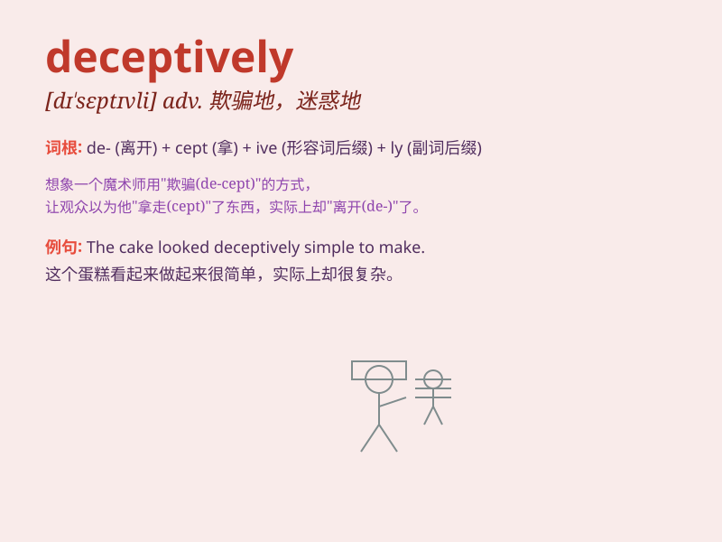

## deceptively

**英音:** _[dɪ\'septɪvli]_ **美音:** _[dɪ\'septɪvli]_

**译义:** *adv.迷惑地,虚伪地*

### 短语

+ **deceptively simple:** _看似简单_

+ **deceptively attractive:** _看似诱人_

+ **deceptively calm:** _看似平静_

+ **deceptively easy:** _看似容易_

+ **deceptively quiet:** _看似安静_

### 例句

#### 例句1

> **The lake looks deceptively calm; beneath the surface, there are
strong currents.**

**中文翻译:** 湖水看似平静，却看似平静。在地表之下，有强大的水流。

**单词释义:** 看似；貌似；给人以假象地

#### 例句2

> **The dress is deceptively simple, but it\'s actually very
elegant.**

**中文翻译:** 这件衣服看似简单，但实际上非常优雅。

**单词释义:** 看似；貌似；给人以假象地

#### 例句3

> **The path ahead seems deceptively short, but it will take much
longer to walk than you think.**

**中文翻译:** 前面的路看似短，但走起来比你想象的要长得多。

**单词释义:** 看似；貌似；给人以假象地

### 背诵小故事

> A thief deceptively wore a disguise to enter the bank. He looked
harmless but was actually planning a robbery. \'Deceptively\' here means
in a way that deceives or gives a false impression.

**一个小偷乔装打扮，看似无害地进入银行。实际上他在谋划抢劫。\'Deceptively\'在这儿指以具有欺骗性或给人错误印象的方式。**

### 图义

