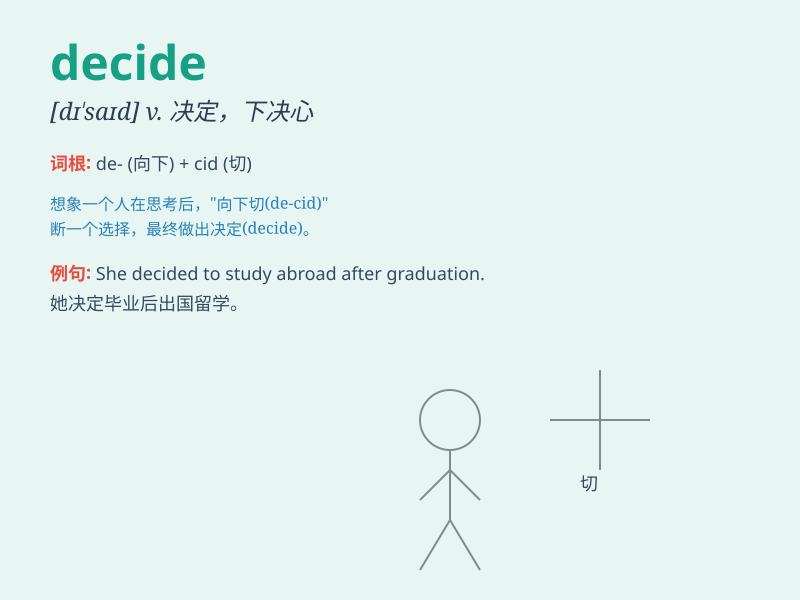

## decide

**英音:** _[dɪ\'saɪd]_ **美音:** _[dɪ\'saɪd]_

**译义:** *v.决定,判决*

### 短语

+ **decide on:** _决定；选定_

+ **decide to do sth:** _决定做某事_

+ **decide against:** _决定不；决定反对_

+ **decide in favor of:** _决定赞成；决定支持_

+ **decide between:** _在\...之间做出决定_

### 例句

#### 例句1

> **I decided to go on a vacation.**

**中文翻译:** 我决定去度假。

**单词释义:** 决定

#### 例句2

> **She couldn\'t decide which dress to wear.**

**中文翻译:** 她无法决定穿哪件衣服。

**单词释义:** 决定

#### 例句3

> **They decided against buying a new car for now.**

**中文翻译:** 他们决定暂时不购买新车。

**单词释义:** 决定

### 背诵小故事

> One day, Tom was faced with two choices: to go on a trip or stay at
home and study. After much thought, he finally DECIDED to go on the
trip. He felt it would be a wonderful experience.

**一天，汤姆面临两个选择：去旅行还是在家学习。经过深思熟虑，他最终决定去旅行。他觉得这会是一次美妙的经历。**

### 图义

