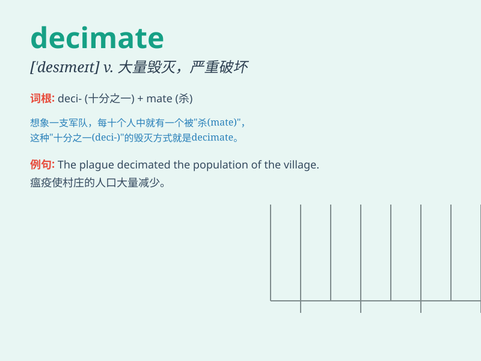

## decimate

**英音:** _[\'desɪmeɪt]_ **美音:** _[\'dɛsə,met]_

**译义:** *vt.每十人杀一人,大批杀害*

### 短语

+ **decimate a population:** _大量毁灭人口_

+ **decimate an army:** _大量消灭一支军队_

+ **decimate the enemy forces:** _大量杀伤敌军_

+ **be decimated by disease:** _因疾病而大量死亡_

+ **decimate the wildlife:** _大量毁灭野生动植物_

### 例句

#### 例句1

> **The disease decimated the population of the village.**

**中文翻译:** 这种疾病导致村里的人口大量减少。

**单词释义:** 大量毁灭；严重破坏

#### 例句2

> **The enemy\'s forces were decimated in the battle.**

**中文翻译:** 敌军在战斗中被歼灭。

**单词释义:** 大量削减；大批杀死

#### 例句3

> **The new tax policy decimated many small businesses.**

**中文翻译:** 新的税收政策摧毁了许多小企业。

**单词释义:** 严重损害；使大大削弱

### 背诵小故事

> In ancient times, a group of 100 soldiers disobeyed orders. The
commander decided to decimate them by randomly choosing and punishing
10. This shows that \'decimate\' means to destroy or kill a large part
of a group.

**在古代，有 100 名士兵违抗命令。指挥官决定惩罚他们，随机挑选并惩处 10
人。这表明'decimate'意味着大量毁灭或杀死某群体中的一部分。**

### 图义

