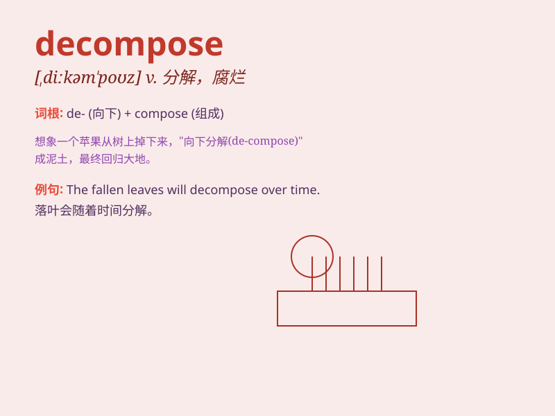

## decompose

**英音:** _[diːkəm\'pəʊz]_ **美音:** _[,dikəm\'poz]_

**译义:** *v.分解,(使)腐烂*

### 短语

+ **decompose into:** _分解成；分成_

+ **decompose gradually:** _逐渐分解_

+ **decompose chemically:** _化学分解_

+ **decompose completely:** _完全分解_

+ **begin to decompose:** _开始分解_

### 例句

#### 例句1

> **Leaves decompose over time to form compost.**

**中文翻译:** 叶子随着时间的推移分解形成堆肥。

**单词释义:** 分解

#### 例句2

> **The body begins to decompose shortly after death.**

**中文翻译:** 人死后不久，尸体就开始腐烂。

**单词释义:** 腐烂；分解

#### 例句3

> **Chemicals are used to decompose the waste.**

**中文翻译:** 使用化学品来分解废物。

**单词释义:** 分解

### 背诵小故事

> A scientist was studying a rotten apple. He found that the apple was
decompose. Bacteria and fungi were breaking it down into simpler
substances. This showed how decompose works in nature.

**一位科学家正在研究一个腐烂的苹果。他发现苹果正在分解。细菌和真菌正在把它分解成更简单的物质。这展示了分解在自然界是如何运作的。**

### 图义

