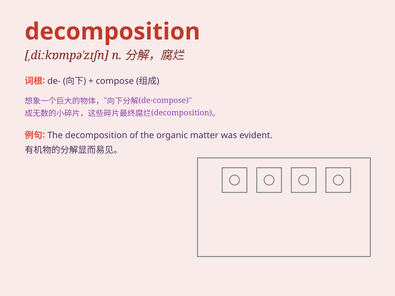

## decomposition

**英音:** _[,diːkɒmpə\'zɪʃn]_ **美音:**
_[,dikɑmpə\'zɪʃən]_

**译义:** *n.分解,腐烂*

### 短语

+ **chemical decomposition:** _化学分解_

+ **biological decomposition:** _生物分解_

+ **thermal decomposition:** _热分解_

+ **decomposition reaction:** _分解反应_

+ **accelerate decomposition:** _加速分解_

### 例句

#### 例句1

> **The decomposition of organic matter is an important process in
the ecosystem.**

**中文翻译:** 有机物的分解是生态系统中的一个重要过程。

**单词释义:** 分解；腐烂

#### 例句2

> **Chemical decomposition occurs when substances break down into
simpler components.**

**中文翻译:** 当物质分解成更简单的成分时，就会发生化学分解。

**单词释义:** 分解；瓦解

#### 例句3

> **The decomposition of the company was a result of poor
management.**

**中文翻译:** 公司的解体是管理不善的结果。

**单词释义:** 解体；分裂

### 背诵小故事

> A scientist was studying decomposition in a forest. He saw a dead
tree slowly breaking down into soil. This process of the tree turning
into smaller parts and nutrients is called decomposition.

**一位科学家在森林里研究分解。他看到一棵死树慢慢分解成土壤。这棵树变成更小的部分和养分的过程就叫做分解。**

### 图义

