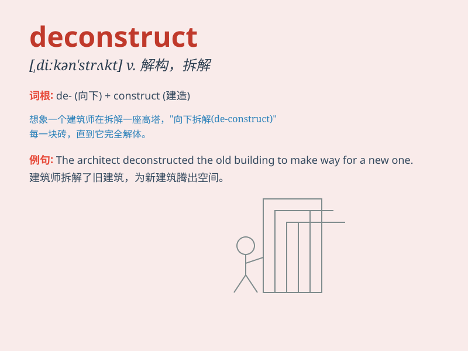

## deconstruct

**英音:** _[ˌdiːkənˈstrʌkt]_ **美音:**
_[ˌdiːkənˈstrʌkt]_

**译义:** *vt.解构；拆析；拆毁*

### 短语

+ **deconstruct an argument:** _解构一个论点_

+ **deconstruct a theory:** _解构一个理论_

+ **deconstruct a text:** _解构一篇文章_

+ **deconstruct a belief:** _解构一种信仰_

+ **deconstruct a concept:** _解构一个概念_

### 例句

#### 例句1

> **The literary critic decided to deconstruct the classic novel to
reveal its underlying themes.**

**中文翻译:**
这位文学评论家决定对这部经典小说进行解构，以揭示其潜在的主题。

**单词释义:** 分析并拆解（文学作品等）以揭示内在结构和意义

#### 例句2

> **We need to deconstruct the problem and find its root cause.**

**中文翻译:** 我们需要解构这个问题并找到其根本原因。

**单词释义:** 分解，剖析（问题等）

#### 例句3

> **The artist attempts to deconstruct traditional forms of
painting.**

**中文翻译:** 这位艺术家试图解构传统的绘画形式。

**单词释义:** 打破，推翻（传统的形式或观念）

### 背诵小故事

> A curious architect decided to deconstruct an old building. He
carefully took it apart, piece by piece, to understand its structure and
design. Just like this, to deconstruct means to break something down
into its parts for analysis.

**一位好奇的建筑师决定对一座老建筑进行解构。他小心翼翼地将其一块一块地拆开，以了解其结构和设计。就像这样，deconstruct
这个词的意思是把某物分解成各个部分进行分析。**

### 图义

