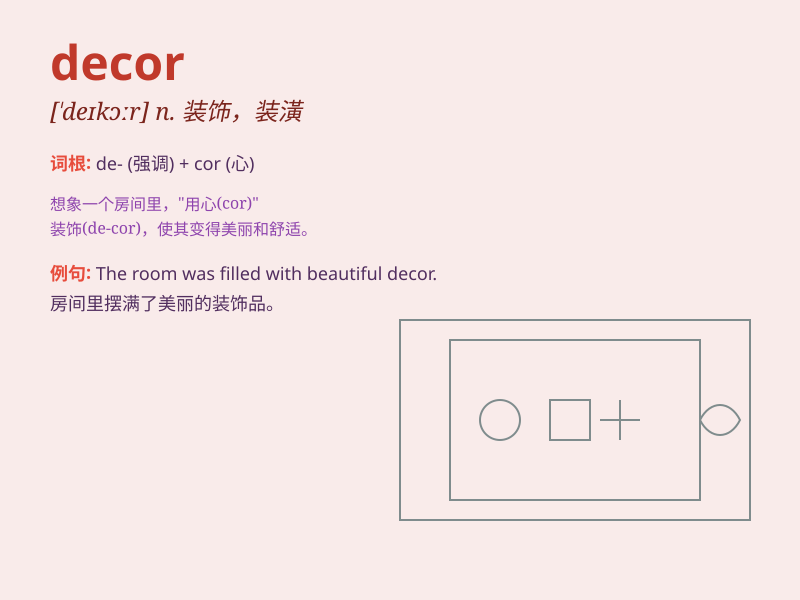

## decor

**英音:** _[\'deɪkɔː; \'de-]_ **美音:** _[de\'kɔr]_

**译义:** *n.舞台装饰,装饰之格调*

### 短语

+ **interior decor:** _室内装饰_

+ **home decor:** _家居装饰_

+ **decor style:** _装饰风格_

+ **decor element:** _装饰元素_

+ **modern decor:** _现代装饰_

### 例句

#### 例句1

> **The decor of the room was elegant and sophisticated.**

**中文翻译:** 房间的装饰优雅而精致。

**单词释义:** 装饰；布置

#### 例句2

> **The new restaurant has a modern decor that attracts many young
people.**

**中文翻译:** 新餐厅装修现代，吸引了很多年轻人。

**单词释义:** 装饰风格；装潢

#### 例句3

> **She spent a lot of time choosing the decor for her wedding.**

**中文翻译:** 她花了很多时间来选择婚礼的装饰。

**单词释义:** 装饰品；饰物

### 背诵小故事

> A designer was invited to decor a room. He chose beautiful curtains
and paintings to make the space more elegant. With his efforts, the
decor of the room became amazing.

**一位设计师受邀装饰一个房间。他挑选了漂亮的窗帘和画作，让空间更优雅。在他的努力下，房间的装饰变得令人惊叹。**

### 图义

