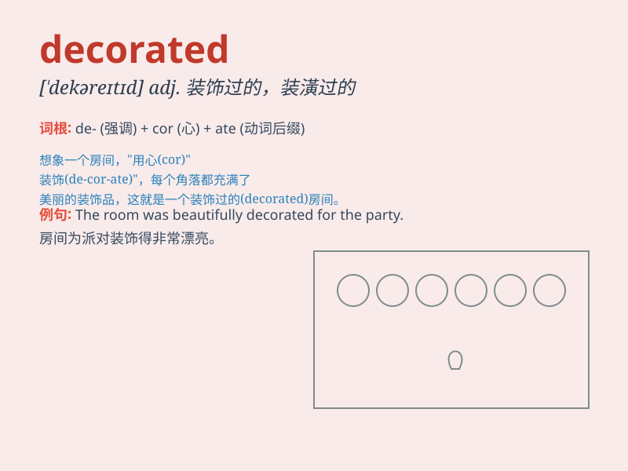

## decorated

**英音:** _[\'dekəreɪtɪd]_ **美音:** _[\'dɛkəˌreɪtɪd]_

**译义:** *adj. 装饰的, 装潢的, 点缀的*

### 短语

+ **be decorated with:** _用\...\...装饰_

+ **decorated style:** _装饰风格_

+ **finely decorated:** _精心装饰的_

+ **decorated room:** _装饰过的房间_

+ **traditionally decorated:** _传统装饰的_

### 例句

#### 例句1

> **The room was decorated with beautiful paintings.**

**中文翻译:** 这个房间用漂亮的画作装饰着。

**单词释义:** 装饰

#### 例句2

> **She decorated the cake with colorful frosting.**

**中文翻译:** 她用彩色的糖霜装饰了蛋糕。

**单词释义:** 装饰

#### 例句3

> **The Christmas tree is beautifully decorated.**

**中文翻译:** 这棵圣诞树被装饰得很美。

**单词释义:** 装饰

### 背诵小故事

> The king\'s palace was decorated with shiny jewels and beautiful
paintings. Every corner was filled with elaborate designs, making it a
wonderland. The word \'decorated\' means to make something look more
attractive by adding ornaments or beautiful things.

**国王的宫殿用闪亮的珠宝和美丽的画作装饰着。每个角落都布满了精美的设计，使其成为一个仙境。单词\'decorated\'意思是通过添加饰品或美丽的东西使某物看起来更具吸引力。**

### 图义

