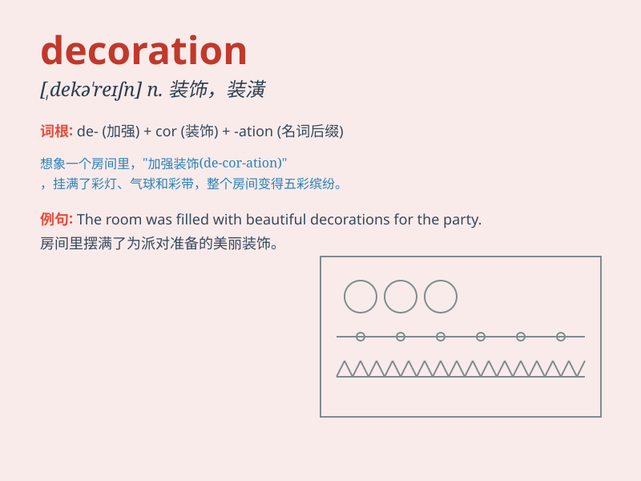

## decoration

**英音:** _[dekə\'reɪʃ(ə)n]_ **美音:** _[,dɛkə\'reʃən]_

**译义:** *n.装饰,装饰品*

### 短语

+ **interior decoration:** _室内装饰_

+ **Christmas decoration:** _圣诞装饰_

+ **wall decoration:** _墙面装饰_

+ **floral decoration:** _花卉装饰_

+ **exquisite decoration:** _精美的装饰_

### 例句

#### 例句1

> **The decoration of the room was very elegant.**

**中文翻译:** 房间的装修非常优雅。

**单词释义:** 装饰；装潢

#### 例句2

> **She spent a lot of money on Christmas decorations.**

**中文翻译:** 她在圣诞装饰品上花了很多钱。

**单词释义:** 装饰品

#### 例句3

> **The decoration of the wedding venue was breathtaking.**

**中文翻译:** 婚礼场地的装饰令人叹为观止。

**单词释义:** 布置

### 背诵小故事

> One day, a little girl was very sad because her room lacked
decoration. So, she decided to make it beautiful. She painted the walls,
hung some pictures, and added colorful curtains. Finally, the room was
filled with wonderful decoration.

**有一天，一个小女孩非常伤心，因为她的房间缺乏装饰。于是，她决定让房间变漂亮。她粉刷了墙壁，挂了一些画，并添加了彩色的窗帘。最后，房间充满了美妙的装饰。**

### 图义

