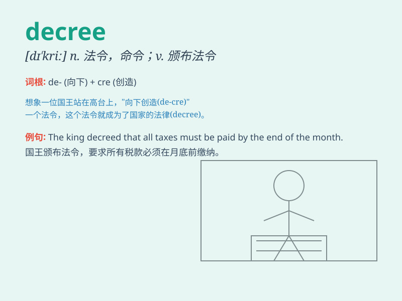

## decree

**英音:** _[dɪ\'kriː]_ **美音:** _[dɪ\'kri]_

**译义:** *n.法令,政令,教令,天命,判决v.颁布*

### 短语

+ **judicial decree:** _司法判决_

+ **imperial decree:** _皇帝的诏令_

+ **executive decree:** _行政命令_

+ **decree nisi:** _（法律）离婚暂准令_

+ **decree absolute:** _（法律）离婚绝对令_

### 例句

#### 例句1

> **The king issued a decree that all taxes would be increased.**

**中文翻译:** 国王颁布法令，增加所有税收。

**单词释义:** 法令；政令

#### 例句2

> **The judge\'s decree was final and could not be appealed.**

**中文翻译:** 法官的判决是最终判决，不能上诉。

**单词释义:** 裁决

#### 例句3

> **By royal decree, the festival was declared a national
holiday.**

**中文翻译:** 根据皇家法令，该节日被宣布为国定假日。

**单词释义:** 法令

### 背诵小故事

> A king issued a decree that everyone must plant a tree to make the
kingdom greener. The decree was spread throughout the land, and people
followed it.

**一位国王颁布了一道法令，要求每个人都必须种一棵树以使王国更绿。这道法令传遍了整个国度，人们都遵循了它。**

### 图义

