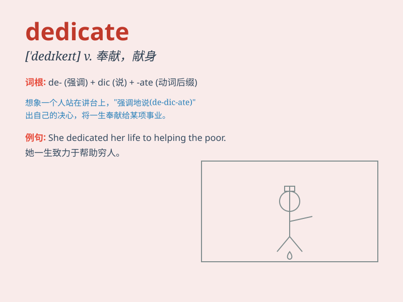

## dedicate

**英音:** _[\'dedɪkeɪt]_ **美音:** _[\'dɛdɪket]_

**译义:** *vt.献(身),致力,题献(一部著作给某人)*

### 短语

+ **dedicate oneself to:** _致力于；献身于_

+ **be dedicated to:** _专注于；致力于_

+ **dedicate sth. to sb.:** _把某物献给某人_

+ **dedicate one\'s life to:** _把一生献给\...\..._

+ **dedicate time/effort to:** _投入时间/努力于_

### 例句

#### 例句1

> **She dedicated her life to helping the poor.**

**中文翻译:** 她一生致力于帮助穷人。

**单词释义:** 奉献，致力于

#### 例句2

> **The book is dedicated to my parents.**

**中文翻译:** 这本书献给我的父母。

**单词释义:** 把\...\...奉献给

#### 例句3

> **He dedicated himself to the task with great enthusiasm.**

**中文翻译:** 他以极大的热情投入到这项任务中。

**单词释义:** 投身于，致力于

### 背诵小故事

> A young artist was determined to dedicate all his time and energy to
creating beautiful paintings. He locked himself in the studio day and
night, showing his total commitment. Finally, his works became famous.

**一位年轻的艺术家决心将自己所有的时间和精力都投入到创作美丽的绘画中。他日夜把自己锁在工作室里，展现出了他全身心的投入。最终，他的作品出名了。**

### 图义

