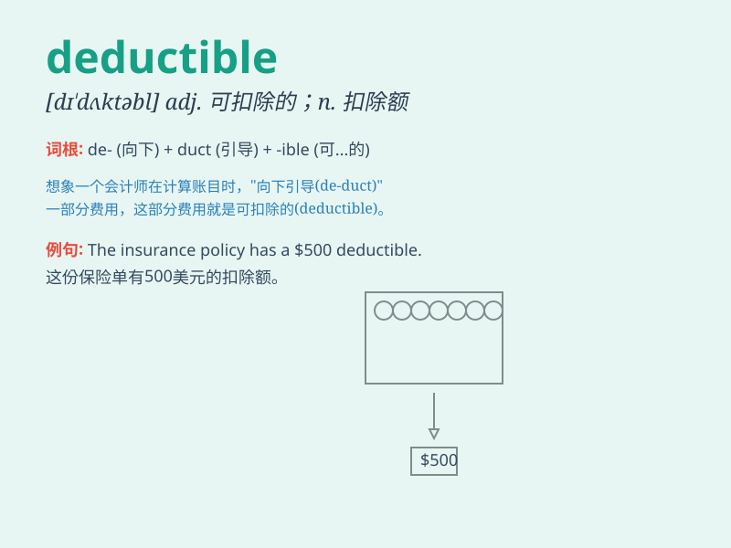

## deductible

**英音:** _[dɪ\'dʌktɪb(ə)l]_ **美音:** _[dɪ\'dʌktəbl]_

**译义:** *adj.可扣除的*

### 短语

+ **deductible expense:** _可扣除费用_

+ **annual deductible:** _年度免赔额_

+ **deductible limit:** _免赔限度_

+ **tax deductible:** _可减税的_

+ **deductible contribution:** _可扣除捐款_

### 例句

#### 例句1

> **The deductible on my insurance policy is quite high.**

**中文翻译:** 我的保险单的免赔额相当高。

**单词释义:** 免赔额

#### 例句2

> **The deductible for this claim is \$500.**

**中文翻译:** 此索赔的免赔额为 500 美元。

**单词释义:** 免赔额

#### 例句3

> **You need to pay the deductible before the insurance coverage
kicks in.**

**中文翻译:** 您需要在保险生效之前支付免赔额。

**单词释义:** 免赔额

### 背诵小故事

> Imagine you have a special insurance policy. Before the insurance
company pays for your big expenses, you have to pay a certain amount
first. That amount is called deductible. So, deductible is the amount
you need to pay out of pocket before getting insurance coverage.

**想象你有一份特殊的保险。在保险公司为你的大笔费用买单之前，你得先支付一定的金额。这个金额就叫做免赔额。所以，deductible
就是在获得保险赔偿前你需要自掏腰包支付的金额。**

### 图义

