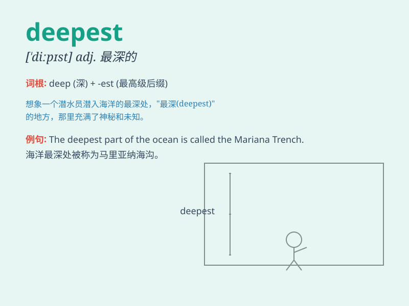

## deepest

**英音:** _[ˈdɪpɪst]_ **美音:** _[ˈdɪpɪst]_

**译义:** *最深的（deep的最高级形式）；最深处的*

### 短语

+ **the deepest part:** _最深的部分_

+ **deepest gratitude:** _深深的感激_

+ **deepest sympathy:** _深切的同情_

+ **deepest secret:** _最隐秘的秘密_

+ **deepest sleep:** _酣睡_

### 例句

#### 例句1

> **The deepest part of the ocean is still a mystery to us.**

**中文翻译:** 海洋的最深处对我们来说仍然是个谜。

**单词释义:** 最深的

#### 例句2

> **She has the deepest love for her family.**

**中文翻译:** 她对她的家人有着最深沉的爱。

**单词释义:** 最深沉的

#### 例句3

> **The well is the deepest in the village.**

**中文翻译:** 这口井是村子里最深的。

**单词释义:** 最深的

### 背诵小故事

> A brave diver went on an adventure. He swam to the deepest part of
the ocean. There, he saw amazing creatures and beautiful corals. It was
a thrilling experience that he would never forget.

**一位勇敢的潜水员去探险。他游到了海洋的最深处。在那里，他看到了神奇的生物和美丽的珊瑚。这是一次他永远不会忘记的惊险经历。**

### 图义

