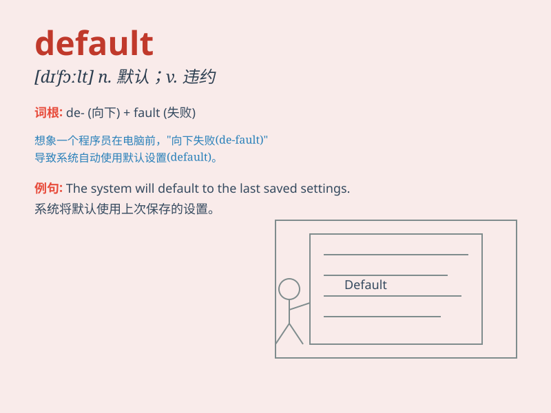

## default

**英音:** _[dɪ\'fɔːlt; \'diːfɔːlt]_ **美音:**
_[dɪ\'fɔlt]_

**译义:**
*n.默认(值),缺省(值),食言,不履行责任,[律]缺席v.疏怠职责,缺席,拖欠,默认*

### 短语

+ **by default:** _默认；缺省_

+ **default risk:** _违约风险_

+ **default setting:** _默认设置_

+ **in default of:** _因缺少；在缺乏\...时_

+ **go into default:** _不履行义务；违约_

### 例句

#### 例句1

> **The computer program has a default setting for font size.**

**中文翻译:** 计算机程序对字体大小有默认设置。

**单词释义:** 默认（的）；预设（的）

#### 例句2

> **If you don\'t make a choice, the system will default to the
standard option.**

**中文翻译:** 如果您不选择，系统将默认为标准选项。

**单词释义:** 默认；自动选择

#### 例句3

> **He defaulted on his loan payments and faced legal
consequences.**

**中文翻译:** 他拖欠贷款并面临法律后果。

**单词释义:** 违约；不履行义务

### 背诵小故事

>
想象一下，小明参加比赛，却没有做任何准备。当被问到为何如此时，他无奈地说这是他的'default'状态，因为他习惯了不努力。这里'default'就是指惯常的、默认的状态。

**想象小明参加比赛没准备，称这是他惯常的、默认的状态，以此辅助记忆'default'意为惯常的、默认的。**

### 图义

