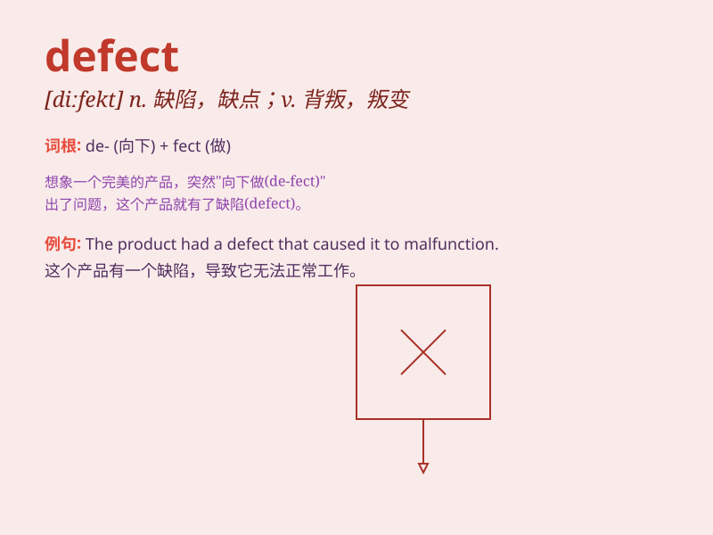

## defect

**英音:** _[\'diːfekt; dɪ\'fekt]_ **美音:** _['dɪfɛkt]_

**译义:** *n.过失,缺点*

### 短语

+ **birth defect:** _先天性缺陷_

+ **heart defect:** _心脏缺陷_

+ **defect rate:** _缺陷率_

+ **major defect:** _重大缺陷_

+ **minor defect:** _轻微缺陷_

### 例句

#### 例句1

> **The product has a defect in its design.**

**中文翻译:** 该产品在设计上存在缺陷。

**单词释义:** 缺陷

#### 例句2

> **He was born with a heart defect.**

**中文翻译:** 他生来就有心脏缺陷。

**单词释义:** 缺陷

#### 例句3

> **The team detected several defects in the manufacturing
process.**

**中文翻译:** 该团队在制造过程中发现了一些缺陷。

**单词释义:** 缺陷

### 背诵小故事

> A brave detective was on a case. He found a hidden document that
exposed a defect in the company\'s security system. The defect could
cause big trouble.

**一位勇敢的侦探正在办案。他发现了一份隐藏的文件，揭露了公司安全系统的一个缺陷。这个缺陷可能会引发大麻烦。**

### 图义

