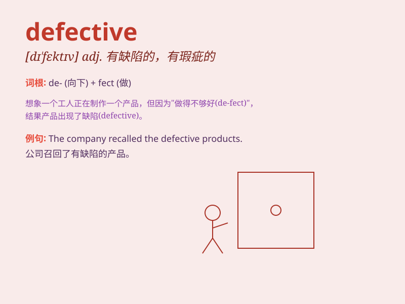

## defective

**英音:** _[dɪ\'fektɪv]_ **美音:** _[dɪ\'fɛktɪv]_

**译义:**
*adj.有缺陷的,(智商或行为有)欠缺的n.有缺陷的人,不完全变化动词*

### 短语

+ **defective product:** _有缺陷的产品_

+ **defective part:** _有缺陷的部件_

+ **defective gene:** _缺陷基因_

+ **defective equipment:** _有故障的设备_

+ **defective goods:** _残次品_

### 例句

#### 例句1

> **The defective product was recalled by the manufacturer.**

**中文翻译:** 有缺陷的产品已被制造商召回。

**单词释义:** 有缺陷的

#### 例句2

> **His hearing was found to be defective.**

**中文翻译:** 他的听力被发现有缺陷。

**单词释义:** 有缺陷的

#### 例句3

> **The machine has a defective part that needs to be replaced.**

**中文翻译:** 机器有一个有缺陷的部件，需要更换。

**单词释义:** 有缺陷的

### 背诵小故事

> A factory was producing toys. But some toys had missing parts and
couldn\'t work properly. They were called defective. Workers had to fix
them to make them good again.

**一家工厂正在生产玩具。但有些玩具缺少部件，不能正常工作。它们被称为有缺陷的。工人们不得不修理它们，使它们再次变好。**

### 图义

