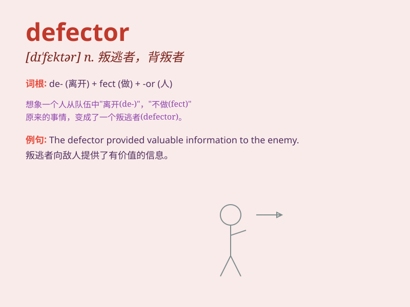

## defector

**英音:** _[dɪˈfektə(r)]_ **美音:** _[dɪˈfektər]_

**译义:** *n.背叛者,叛离者*

### 短语

+ **political defector:** _政治叛逃者_

+ **defector from justice:** _逃犯_

+ **defector to the enemy:** _投敌者_

+ **notorious defector:** _臭名昭著的叛逃者_

+ **recent defector:** _近期的叛逃者_

### 例句

#### 例句1

> **The defector provided valuable intelligence to the enemy.**

**中文翻译:** 叛逃者向敌人提供了宝贵的情报。

**单词释义:** 叛逃者

#### 例句2

> **The defector\'s actions were seen as a betrayal by his former
comrades.**

**中文翻译:** 叛逃者的行为被他以前的战友视为背叛。

**单词释义:** 叛逃者

#### 例句3

> **The government is hunting for the defector who fled the
country.**

**中文翻译:** 政府正在追捕逃离该国的叛逃者。

**单词释义:** 叛逃者

### 背诵小故事

> A soldier was once very loyal, but due to unfair treatment, he became
a defector. He left his team, seeking a better place. Remember, a
defector is one who leaves a group or organization.

**一名士兵曾经非常忠诚，但由于受到不公平的待遇，他变成了一个叛逃者。他离开了自己的队伍，去寻找更好的去处。记住，defector
就是离开一个团体或组织的人。**

### 图义

