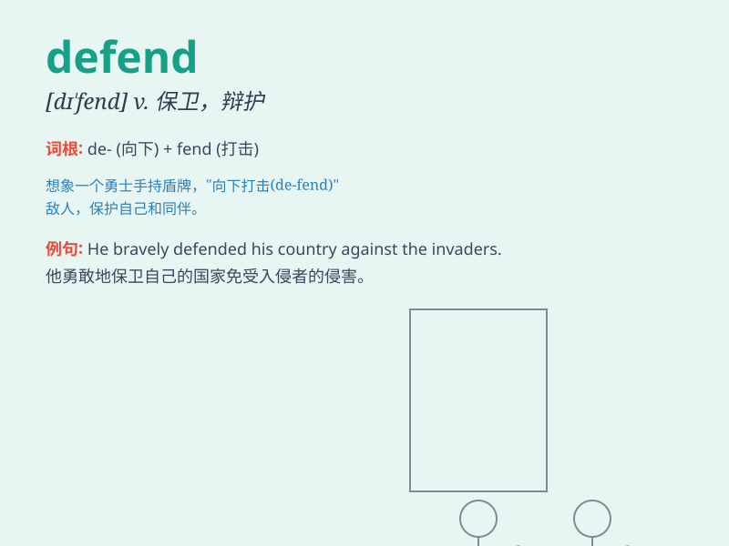

## defend

**英音:** _[dɪ\'fend]_ **美音:** _[dɪ\'fɛnd]_

**译义:** *vt.防护,辩护,防卫,[律]作\...的辩护律师*

### 短语

+ **defend oneself:** _为自己辩护；自卫_

+ **defend against:** _防御；抵抗_

+ **defend from:** _保护......免受......_

+ **defend with:** _用......防御_

+ **defend the cause:** _捍卫事业_

### 例句

#### 例句1

> **The soldiers are trained to defend the country.**

**中文翻译:** 士兵们接受训练是为了保卫国家。

**单词释义:** 保卫

#### 例句2

> **He defended his actions in the meeting.**

**中文翻译:** 他在会议上为自己的行为进行了辩护。

**单词释义:** 辩护

#### 例句3

> **The lawyer will defend the accused in court.**

**中文翻译:** 律师将在法庭上为被告辩护。

**单词释义:** 为\...\...辩护

### 背诵小故事

> In a fierce battle, our brave soldiers stood firmly to defend the
city. They held their weapons tight, not allowing the enemy to invade.
Their determination was unwavering, and they successfully protected our
home.

**在一场激烈的战斗中，我们勇敢的士兵坚定地站着保卫城市。他们紧紧握着武器，不让敌人入侵。他们的决心坚定不移，成功地保护了我们的家园。**

### 图义

