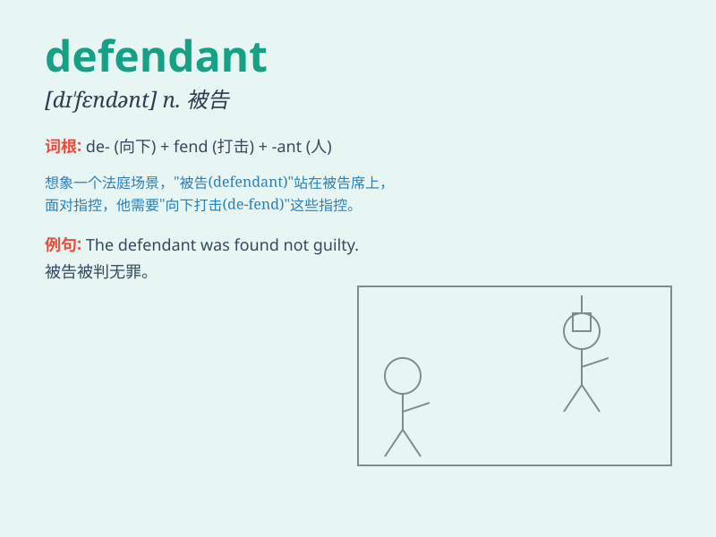

## defendant

**英音:** _[dɪ\'fend(ə)nt]_ **美音:** _[dɪ\'fɛndənt]_

**译义:** *n.被告adj.辩护的,为自己辩护的*

### 短语

+ **the defendant in a lawsuit:** _诉讼中的被告_

+ **defendant\'s statement:** _被告的陈述_

+ **criminal defendant:** _刑事被告_

+ **defendant\'s attorney:** _被告的律师_

+ **civil defendant:** _民事被告_

### 例句

#### 例句1

> **The defendant was found guilty of the crime.**

**中文翻译:** 被告被判犯有该罪。

**单词释义:** 被告

#### 例句2

> **The defendant\'s lawyer presented strong evidence in court.**

**中文翻译:** 被告律师在法庭上提供了有力的证据。

**单词释义:** 被告

#### 例句3

> **The defendant remained silent throughout the trial.**

**中文翻译:** 被告在整个庭审过程中一直保持沉默。

**单词释义:** 被告

### 背诵小故事

> In a courtroom drama, the poor man was the defendant. He was wrongly
accused but remained calm. Finally, the truth came out and he was proved
innocent. Remember, a defendant is the person accused in a court case.

**在一场法庭剧中，这个可怜的男人是被告。他被错误地指控但保持冷静。最后，真相大白，他被证明是无辜的。记住，defendant
就是法庭案件中被指控的人。**

### 图义

