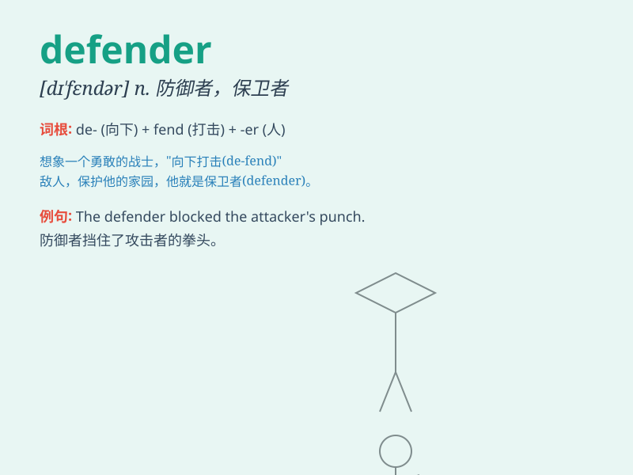

## defender

**英音:** _[dɪ\'fendə(r)]_ **美音:** _[dɪ\'fɛndɚ]_

**译义:** *n.防卫者,拥护者,辩护者,[运动]卫冕者*

### 短语

+ **public defender:** _公设辩护人_

+ **defender of the faith:** _宗教信仰的捍卫者_

+ **champion defender:** _冠军捍卫者_

+ **loyal defender:** _忠诚的捍卫者_

+ **effective defender:** _有效的防御者_

### 例句

#### 例句1

> **The team\'s defender made a crucial tackle to prevent the
goal.**

**中文翻译:** 球队后卫做出了一次关键铲断，阻止了进球。

**单词释义:** 后卫

#### 例句2

> **She is a passionate defender of human rights.**

**中文翻译:** 她是一位热情的人权捍卫者。

**单词释义:** 捍卫者

#### 例句3

> **The castle\'s defenders were outnumbered by the attacking
army.**

**中文翻译:** 城堡守军的人数远远少于进攻的军队。

**单词释义:** 守卫者

### 背诵小故事

> In a fierce battle, the city was under attack. But a brave warrior
named Tom emerged as the defender. He fought fearlessly, protecting
everyone. With his strong shield and sharp sword, Tom was the last line
of defense against the enemy.

**在一场激烈的战斗中，城市受到了攻击。但一位名叫汤姆的勇敢战士成为了捍卫者。他无畏地战斗，保护着每一个人。凭借他坚固的盾牌和锋利的剑，汤姆是抵御敌人的最后一道防线。**

### 图义

